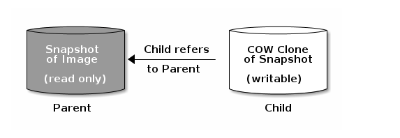
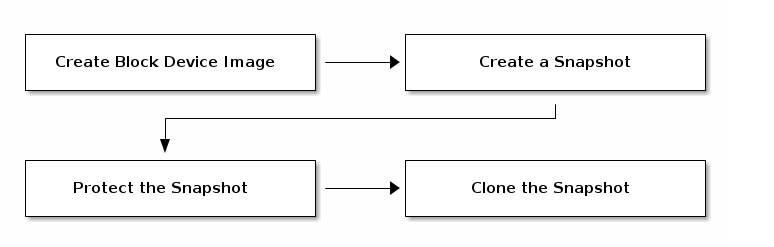
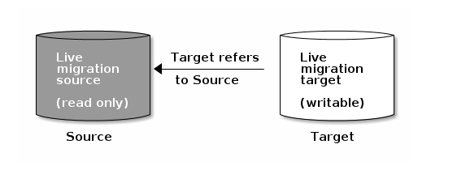
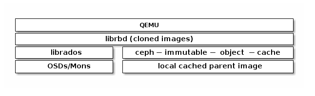
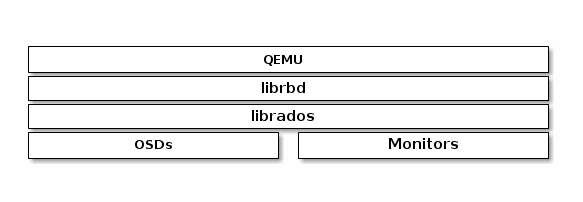
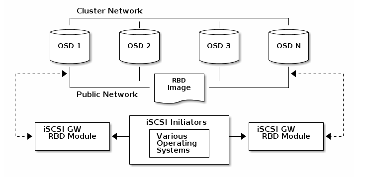

# Ceph块设备  

块是一个字节序列（例如，一个512字节的数据块）。基于块的存储接口是最常见的存储数据的方法，它通常基于旋转介质，像硬盘、CD、软盘，甚至传统的9道磁带。  

# 基本的块设备命令  

rbd命令可以让你创建、罗列、审查和删除块设备image。你也可以用它来克隆image、创建快照、回滚快照、查看快照等。关于rbd命令使用细节，可查看[<font color="red">RBD - Manage RADOS Block Device(RBD) Images</font>](https://docs.ceph.com/docs/master/man/8/rbd/)来了解详情。  

## 创建块设备资源池  

1. 在管理节点，使用ceph工具<font color="red">创建一个资源池</font>。
2. 在管理节点，使用rbd工具RBD来初始化资源池：

> rbd pool init \<pool-name>

## 创建块设备用户  

除非另有说明，否则rbd命令将使用管理员ID访问Ceph集群。此ID允许对集群进行完全的管理访问。建议尽可能使用限制更严格的用户。  

<font color="red">创建Ceph用户</font>，可以使用Ceph命令`auth get-or-create`，需要提供用户名称、监视器和OSD：
   
> ceph auth get-or-create client.{ID} mon 'profile rbd' osd 'profile {profile name} [pool={pool-name}] [, profile ...]'  

例如，创建一个命名称为qemu用户ID，拥有读写权限访问vms资源池，只读images资源池，执行下列命令：  

> ceph auth get-or-create client.qemu mon 'profile rbd' osd 'profile rbd pool=vms,profile rbd-read-only pool=images'

ceph auth get-or-create 命令的输出是新增用户的密钥环，可以写入到*/etc/ceph/cepn.client.{ID}.keyring*文件中。  

## 创建块设备image  

在你将块设备挂载到节点之前，你必须先在Ceph存储集群中创建一个image。可以使用以下命令创建块设备image：  

> rbd create --size {megabytes} {pool-name}/{image-name}

例如，在名称为`swimmingpool`的资源池中创建一个名称为`bar`的1Gimage来存储消息，执行以下命令：  

> rbd create --size 1024 swimmingpool/bar

如果在创建image时你不指明资源池，image将被存储在默认的资源池`rbd`中。例如，在默认的资源池`rbd`中创建一个名称为`foo`的1G大小的image：  

> rbd create --size 1024 foo

## 罗列块设备image  

罗列`rbd`资源池中的块设备image，可以执行以下命令：  

> rbd ls

罗列指定资源池中的块设备image，可以执行以下命令，但需要将`{poolname}`替换为指定的资源池名称：  

> rbd ls {poolname}

例如：  

> rbd ls swimmingpool  

罗列`rbd`资源池回收站中的待删除的块设备，执行以下命令：  

> rbd trash ls

罗列指定资源池回收站中待删除的块设备，可以执行以下命令，但需要将`{poolname}`替换为指定的资源池名称：  

> rbd trash ls {poolname}

例如：  

> rbd trash ls swimming

## 检索image信息   

检索指定image的信息，可以执行以下命令，但需要将`{image-name}`替换为指定的image名称：

> rbd info {image-name}

例如：  

> rbd info foo  

检索指定资源池中image的信息，可以执行以下命令，但需要将`{image-name}`替换成image名称，`{pool-name}`替换成资源池名称：  

> rbd info {pool-name}/{image-name}

例如：  

> rbd info swimmingpool/bar

## 重置块设备image大小  

<font color="red">Ceph块设备</font>是精简配置的。在你开始在其上保存数据之前它们不会占用任何物理存储。但是它们确实具有你使用`--size`操作指定的最大容量。如果你想增加（或者减小）Ceph块设备的最大尺寸，可以执行以下命令：  

> rbd resize --size 2048 foo (to increase)
> rbd resize --size 2048 foo --allow-shrink (to decrease)

## 删除块设备image  

删除块设备image，可以使用以下命令，但需要将`{image-name}`替换为你想要删除的image名称：  

> rbd rm {image-name}

例如：  

> rbd rm foo

删除指定资源池中的块设备，可以执行以下命令，但需要将`{image-name}`替换成你想要删除的image名称，`{pool-name}`替换成资源池名称：  

> rbd rm {pool-name}/{image-name}

例如：  

> rbd rm swimming/bar

要从资源池回收站中移除块设备，可以执行以下命令，但需要将`{image-name}`替换成你想要删除的image名称，`{pool-name}`替换成资源池名称：  

> rbd trash mv {pool-name}/{image-name}

例如：  

> rbd trash mv swimming/bar

要从资源池回收站中删除块设备，可以执行以下命令，但需要将`{image-id}`替换成你想要删除的image的id，`{pool-name}`替换成资源池名称：  

> rbd trash rm {pool-name}/{image-id}

例如：  

> rbd trash rm swimming/2bf4474bodc51

```text
Note:
    · 你可以将image移动到回收站中，即使它拥有快照或其副本正在使用中，但是不能将它从回收站中删除。
    · 你可以使用 --expires-at 来设置滞留时间（默认为当前时间），如果尚未到达滞留时间，除非你使用 --force，否则它不会被删除
```  

## 恢复块设备image  

恢复`rbd`资源池中待删除的块设备，可以使用以下命令，但需要将`{image-id}`替换为imageid：  

> rbd trash restore {image-id}

例如：  

> rbd trash restore 2bf4474b0dc51

恢复指定资源池中待删除的块设备，可以使用以下命令，但需要将`{image-id}`替换为imageid，`{pool-name}`替换为资源池名称：  

> rbd trash restore {pool-name}/{image-id}

例如：  

> rbd trash restore swimming/2bf4474b0dc51  

你也可以恢复image时使用 --image 来重命名称它：  

例如：  

> rbd trash restore swimming/2bf4474b0dc51 --image new-name  

# 块设备操作  

## 快照  

快照是指定时间点image状态的一种只读拷贝。Ceph块设备的一种高级操作是你可以闯将一个image的快照来保存image状态的历史记录。Ceph还支持快照分层，允许你快速轻松地克隆image（例如，VMimage）。Ceph使用rbd命令和更高级的接口，包括<font color="red">QEMU</font>，<font color="red">libvirt</font>，<font color="red">OpenStack</font>和<font color="red">CloudStack</font>，来支持快照。  

### CEPHX 笔记  

当cephx启用（默认启用）时，则你必须指定一个用户名称或ID以及包含有用户对应的密钥的密钥环的路径。详情参见[<font color="red">用户管理</font>](https://docs.ceph.com/docs/master/rados/operations/user-management/#user-management)。你也可以将CEPH_ARGS添加到环境变量中来避免重复输入以下参数：  

> rbd --id {user-ID} --keyring=/path/to/secret [commands]
> rbd --name {username} --keyring=/path/to/secret [commands]  

例如：  

> rbd --id admin --keyring=/etc/ceph/ceph.keyring [commands]
> rbd --name client.admin --keyring=/etc/ceph/ceph.keyring [commands]

### 快照基本操作  

接下来介绍如何在命令行下使用rbd命令来创建、罗列和删除快照。  

#### 创建快照  

使用rbd创建快照，snap create额外选项包括资源池名称和image名称。  

> rbd snap create {pool-name}/{image-name}@{snap-name}

例如：  

> rbd snap create rbd/foo@snamname

#### 罗列快照  

要罗列image的快照，需要额外指定资源池名称和image名称：  

> rbd snap ls {pool-name}/{image-name}

例如：  

> rbd snap ls rbd/foo

#### 回滚快照  

使用rbd回滚快照，snap rollback操作需要额外指明资源池名称、image名称和快照名称：  

> rbd snap rollback {pool-name}/{image-name}@{snap-name}

例如：  

> rbd snap rollback rbd/foo@snapname

#### 删除快照  

使用rbd删除快照，snap rm操作需要额外指明资源池名称、image名称和快照名称：  

> rbd snap rm {pool-name}/{image-name}@{snap-name}

例如：  

> rbd snap rm rbd/foo@snapname

#### 清空快照  

使用rbd删除image的所有快照，snap purge操作需要额外指明资源池名称、image名称：  

> rbd snap purge {pool-name}/{image-name}

例如：  

> rbd snap purge rbd/foo

### 分层  

Ceph支持创建多个块设备快照的写时复制克隆。快照分层可以使Ceph块设备客户端快速地创建image。例如，你可以创建一个写有Linux VM的块设备image；然后，快照image，保护快照，创建任意数量的写时复制克隆体。因为快照是只读的，克隆快照简化了语义，使得快速创建克隆体成为可能。  

  

每个克隆的image（子）都存储着父image的引用，这使得克隆的image可以打开父快照并读取它。  

快照的写时复制克隆行为跟其它的Ceph块设备image一样。你可以读、写、克隆和重设克隆的image的大小。克隆的image没有特殊的限制。然而，快照的写时复制克隆指的是快照，所以在你克隆快照之前你必须保护它。下面的示意图描述的就是这个过程。  

#### 分层入门  

Ceph块设备分层是个简单的操作。你必须有一个image，必须创建这个image的快照，必须保护这个快照。一旦已完成了这些步骤，你就可以开始克隆快照了。  



克隆的image保留了父快照的引用，并包含了资源池ID、imageID和快照ID。包含资源池ID意味着可以将快照从一个资源池克隆到另一个资源池中的image。  

1. **Image Template**：块设备分层的一个常见的使用场景是创建一个主image和一个快照，作为克隆的模板。例如，用户可能创建一个Linux发行版（例如，Ubuntu 12.04）的image，并为它创建快照。用户可能会周期性地更新image并创建新的快照（例如，`sudo apt-get update`，`sudo apt-get upgrade`，`sudo apt-get dist-upgrade`之后使用`rbd snap create`创建新的快照）。随着image的完善，用户可以克隆快照中的任何一个。


2. **Extended Template**：更高级的使用场景是包含扩展模板image，提供比基础image更多的信息。例如，用户可能克隆一个image（例如，VM模板）并且安装其它的软件（例如，数据库，内容管理系统，分析系统），然后快照扩展后的image，它本身可以像基础image一样被更新。  


3. **Template Pool**：使用块设备分层的一个方法是创建一个资源池，其中包括作为模板的主image以及那些模板的快照。然后你可以将制度权限扩展到其他用户，这样他们就可以克隆快照，但不能在资源池中写入和执行。  


4. **Image Migration/Recovery**：使用块设备分层的一个方法从一个资源池迁移或恢复到另一个资源池。  

#### 保护快照  

克隆体可以访问父快照。如果用户不小心删除了父快照，那么所有的克隆体都将损坏。为了防止数据丢失，在你克隆快照前你**必须**保护它。  

> rbd snap protect {pool-name}/{image-name}@{snapshot-name}  

例如：  

> rbd snap protect rbd/my-image@my-snapshot  

#### 克隆快照  

要克隆快照，你需要额外说明的信息有父资源池、image和快照，以及子资源池和image名称称。在你克隆快照之前你**必须**先保护它。

> rbd clone {pool-name}/{parent-image}@{snap-name} {pool-name}/{child-image-name}

例如：  

> rbd clone rbd/my-image@my-snapshot rbd/new-image

#### 解保快照  

在你删除快照之前，你必选先接触保护。另外，你**不能**删除具有克隆体引用的快照。在你删除快照之前，你**必须**平整该快照的所有克隆。

> rbd snap unprotect {pool-name}/{image-name}@{snapshot-name}

例如：  

> rbd snap unprotect rbd/my-image@my-snapshot

#### 罗列快照的子快照  

要罗列一个快照的子快照，可以执行以下命令：  

> rbd children {pool-name}/{image-name}@{snapshot-name}

例如：  

> rbd childre rbd/my-image@my-snapshot  

#### 平整克隆的image  

克隆的image保留了到父快照的引用。当你移除子克隆体到父快照的引用时，通过从快照拷贝信息到克隆体，你可以高效地“平整”image。平整image花费的时间随着快照体积的增大而增大。要想删除快照，你必须先平整它的子image。  

> rbd flatten {pool-name}/{image-name}

例如：  

> rbd flatten rbd/new-image  

## RBD 镜像  

RBDimage可以在两个Ceph集群间异步备份。该能力利用了RBD日志image特性来保证集群间的crash-consistent复制。镜像功能需要在同伴集群中的每一个对应的pool上进行配置，可设定自动备份某个存储池内的所有images或仅备份images的一个特定子集。用rbd命令来配置镜像功能。rbd-mirror守护进程负责从远端集群拉取image的更新，并写入本地集群的对应image中。  

根据复制的需要，RBD镜像可以配置为单向或者双向复制：  

* **单向复制**：当数据仅从主集群镜像到从集群时，rbd-mirror守护进程只运行在从集群。
* **双向复制**：当数据从一个集群上的主映像镜像到另一个集群上的非主映像(反之亦然)时，rd -mirror守护进程在两个集群上运行。  

### 资源池配置  

下面的程序说明如何使用rbd命令执行基本的管理任务来配置镜像功能。镜像功能需要在同伴集群中的每一个对应的pool上进行配置。  

资源池的配置操作应在所有的同伴集群上执行。为了清晰起见，这些过程假设可以从单个主机访问两个集群，分别称为“local”和“remote”。  

有关如何连接到不同Ceph集群的详细信息，请参阅[<font color="red">rbd</font>](https://docs.ceph.com/docs/master/man/8/rbd)手册页。  

#### 启用镜像功能  

使用rbd启用镜像，需要`mirror pool enable`命令，指明资源池名称和镜像模式：  

> rbd mirror pool enable {pool-name} {mode}

镜像模式可以是pool或image：  

* **pool**：当配置为pool模式时，带有日志特性的资源池中的所有image都将被镜像。
* **image**：当配置为image模式时，每个image的镜像功能都需要被[<font color="red">显示启用</font>](https://docs.ceph.com/docs/master/rbd/rbd-mirroring/#enable-image-mirroring)。

例如：  

```bash
$ rbd --cluster local mirror pool enable image-pool pool
$ rbd --cluster remote mirror pool enabel image-pool pool
```  

#### 禁用镜像  

使用rbd禁用镜像，需要额外的`mirror pool disable`命令和资源池名称：  

> rbd mirror pool disable {pool-name}

以这种方式在池上禁用镜像时，对于已明确启用镜像的任何映像（池内），也将禁用镜像。  

例如：  

```bash
$ rbd --cluster local mirror pool disable image-pool
$ rbd --cluster remote mirror pool disable image-pool
```  

#### 新增集群伙伴  

为了让`rbd-mirror`守护进程发现它的伙伴集群，伙伴集群需要被注册到资源池中。使用rbd新增镜像伙伴Ceph集群，需要额外的`mirror pool peer`添加命令、资源池名称和集群说明：  

> rbd mirror pool peer add {pool-name} {client-name}@{cluster-name}

例如：  

```bash
$ rbd --cluster local mirror pool peer add image-pool client.remote@remote
$ rbd --cluster remote mirror pool peer add image-pool client.local@local
```

默认情况下，`rbd-mirror`守护进程需要有访问位于*/etc/ceph/{cluster-name}.conf*的Ceph配置的权限，它提供了伙伴集群的监视器地址；此外还有位于默认或者配置的密钥环检索路径（例如，/etc/ceph/{cluster-name}.{client-name}.keyring）下的密钥环的访问权限。  

另外，伙伴集群的监视器或客户端密钥可以安全地存储在本地Ceph监视器的confi-key存储中。要在添加伙伴镜像时指定伙伴集群的连接属性，请使用`--remote-mon-host`和`--remote-key-file`选项。例如：  

```bash
$ rbd --cluster local mirror pool peer add image-pool client.remote@remote --remote-mon-host 192.168.1.1,192.168.1.2 --remote-key-file < (echo 'AQAeuZdbMMoBChAAcj++/XUxNOLFaWdtTREEsw==')
$ rbd --cluster local mirror pool info image-pool --all
Mode: pool
Peers:
  UUID                                 NAME   CLIENT        MON_HOST                KEY
  587b08db-3d33-4f32-8af8-421e77abb081 remote client.remote 192.168.1.1,192.168.1.2 AQAeuZdbMMoBChAAcj++/XUxNOLFaWdtTREEsw==
```  

#### 移除伙伴集群  

要使用rbd移除镜像伙伴Ceph集群，需要额外的`mirror pool peer remove`命令、资源池名称和伙伴的UUID（可从`rbd mirror pool info`命令获取）：  

> rbd mirror pool peer remove {pool-name} {peer-uuid}

例如：  

```bash
$ rbd --cluster local mirror pool peer remove image-pool 55672766-c02b-4729-8567-f13a66893445
$ rbd --cluster remote mirror pool peer remove image-pool 60c0e299-b38f-4234-91f6-eed0a367be08
```  

#### 数据池  

在目标集群上创建images时，`rbd-mirror`收集如下数据池：  

1. 如果目标集群有配置好的默认数据池（`rbd_default_data_pool`配置选项），那么这个数据池会被使用。
2. 否则，如果源image使用单独的数据池，且目标集群上存在同名称的数据池，则使用该池。
3. 如果以上都不成立，则不会设置数据池  

### Image 配置  

与资源池配置不同，image配置只需针对单个镜像的伙伴集群进行操作。  

镜像RBD image被指定为主image或非主image。这是image的属性而不是池的属性。被指定为非主image的image不可修改。  

在image上第一次启用镜像时，image会自动提升为主image（如果镜像模式为池模式，且image启用了日志image特性，则会隐式地将image提升为主image，或者通过rbd命令[显式启用](https://docs.ceph.com/docs/master/rbd/rbd-mirroring/#enable-image-mirroring)镜像）。  

#### 启用image日志支持  

RBD镜像使用RBD日志特性来确保复制的image总是保持crash-consistent。在image可以被镜像到伙伴集群之前，日志特性必须启用。改特性可以在image创建时通过使用rbd命令，提供`--image-feature exclusive-lock,journaling`选项来启用。  

或者，日志特性可以在预先存在的RBD images上启用。要使用rbd启用日志，需要额外的`feature enable`命令、资源池名称、image名称和特性名称：  

> rbd feature enable {pool-name}/{image-name} {feature-name}

例如：  

> $ rbd --cluster local feature enable image-pool/image-1 journaling

#### 启用image镜像  

如果镜像是以image池的image模式配置的，则需要显式地为池中的每个image启用镜像。要使用rbd为特定的image启用镜像，需要额外的`mirror image enable`命令、资源池名称和image名称：  

> rbd mirror image enable {pool-name}/{image-name}

例如：  

> $ rbd --cluster local mirror image enable image-pool/image-1

#### 禁用image镜像  

要使用rbd禁用特定的image镜像，需要额外的`mirror image disable`命令、资源池名称和image名称：  

> rbd mirror image disable {pool-name}/{image-name}

例如：  

> $ rbd --cluster local mirror image disable image-pool/image-1

#### image 晋级和降级  

在故障转移场景中，需要将主节点转移到伙伴集群的image中，应该停止对主image的访问（例如，关闭VM或从VM中移除关联的设备），降级当前的主image，提升新的主image，且恢复对备用集群上image的访问。  

要使用rbd将指定的image降级为non-primary，需要额外的`mirror image demote`命令、资源池名称和image名称：  

> rbd mirror image demote {pool-name}/{image-name}

例如：  

> $ rbd --cluster local mirror image demote image-pool/image-1

要是用rbd将池中的所有主image降级为non-primary，需要额外的`mirror pool demote`命令和资源池名称：  

> rbd mirror pool demote {pool-name}

例如：  

> $ rbd --cluster local mirror pool demote image-pool  

要使用rbd将指定的image升级为primary，需要额外的`mirror image promote`命令、资源池名称和image名称：  

> rbd mirror image promote [--force] {pool-name}/{image-name}

例如：  

> $ rbd --cluster remote mirror image promote image-pool/image-1  

要是用rbd将池中的所有的non-primary image升级为primary，需要额外的`mirror pool promote`命令和资源池名称：  

> rbd mirror pool promote [--force] {pool-name}

例如：  

> $ rbd --cluster local mirror pool promote image-pool  

#### 强制image同步  

如果rbd-mirror守护进程检测到有裂脑事件，则在更正之前它不会镜像受到影响的image。要恢复image镜像，首先要降级已过期的image，然后请求同步到主image。要使用rbd请求同步image，需要额外的`mirror image resync`命令，池名称和image名称：  

> rbd mirror image resync {pool-name}/{image-name}

例如：  

> $ rbd mirror image resync image-pool/image-1

### 镜像状态  

伙伴集群的副本状态存储在每个主镜像中。该状态可被`mirror image status`和`mirror pool status`命令检索到。  

要使用rbd命令请求镜像状态，需要额外的`mirror image status`命令，池名称和image名称：  

> rbd mirror image status {pool-name}/{image-nmae}

例如：  

> $ rbd mirror image status image-pool/image-1

要使用rbd命令请求镜像池的总体状态，需要额外的`mirror pool status`命令和池名称：  

> rbd mirror pool status {pool-name}

例如：  

> $ rbd mirror pool status image-pool

### RBD-mirror 守护进程  

两个rbd-mirror守护进程负责监听远端image日志、伙伴集群和重放本地集群的日志事件。RBD image日志特性安装出现的顺序记录下所有对image的修改。这确保了远程镜像的crash-consistent在本地可以。  

每个rbd-mirror守护进程应该使用唯一的Ceph用户ID。要使用ceph创建一个Ceph用户，需要额外的`auth get-or-create`命令，用户名、监视器上限和OSD上限：  

> ceph auth get-or-create client.rbd-mirror.{unique id} mon 'profile rbd-mirror' osd 'profile rbd'

通过指定用户ID作为守护进程实例，systemd可以管理rbd-mirror守护进程：  

> systemctl enable ceph-rbd-mirror@rbd-mirror.{unique id}

rbd-mirror也可以在前台通过rbd-mirror命令启动：  

> rbd-mirror -f --log-file={log_path}  

## image实时迁移  

RBD images可以在同一集群的不同资源池或不同image格式和布局之间实时迁移。启动时，源image会被深拷贝到目标image上，提取所有快照历史记录，并可选择保留到源image的父image的任何链接，以帮助保持稀疏性。  

新的目标image在使用的同时赋值操作可以安全地在后台运行。在准备迁移之前，需要暂时停止使用源image，这有助于确保该image的客户端被更新为指向新的目标image。  

  

实时迁移过程由三步组成：  

1. **准备迁移**：初始步骤创建新的目标image并交叉链接源image和目标image。与<font color="red">分层映像</font>相似，尝试读取目标image中未初始化的区域将在内部重定向到源image，而写入目标image中未初始化区域将在内部将重叠的源image块深拷贝到目标image。
2. **执行迁移**：将所有初始化的块从源image深拷贝到目标，该操作在后台执行。此步骤可以在客户端活跃访问新目标image时执行。
3. **结束迁移**：一旦后台迁移操作完成，就可以提交或者中断迁移。提交迁移将删除源与目标image之间的交叉链接并移除源image。中断迁移将移除交叉链接并移除目标image。  

### 准备迁移  

执行`rbd migration prepare`命令初始化实时迁移操作，需要体统源与目标images：  

> $ rbd migration prepare migration_source [migration_target]  

`rbd migration prepare`命令接收与`rbd create`命令相同的布局选项,它允许更改磁盘上不可更改的image布局。如果只是更改磁盘上的布局，*migration_target*可省略，沿用原始image名称。  

准备进行实时迁移前，所有使用源image的客户端都必须停止使用。如果发现有任何客户端以读/写模式打开image，准备步骤将会失败。一旦准备步骤完成，客户端可以使用心得目标image名称重启。尝试使用源image重启的客户端将重启失败。  

`rbd status`命令可以展示实时迁移的当前状态：  

```bash
$ rbd status migration_target
Watchers: none
Migration:
            source: rbd/migration_source (5e2cba2f62e)
            destination: rbd/migration_target (5e2ed95ed806)
            state: prepared
```

注意，源image将被移动到RBD回收站中，以防迁移过程中的误操作：  

```bash
$ rbd info migration_source
rbd: error opening image migration_source: (2) No such file or directory
$ rbd trash ls --all
5e2cba2f62e migration_source
```

### 执行迁移  

准备完实时迁移之后，image块必须从源image中复制到目标image中。执行`rbd migration execute`命令可以实现上述操作：  

```bash
$ rbd migration execute migration_target
Image migration: 100% complete...done.
```

`rbd status`命令也可提供深拷贝过程中迁移块操作的反馈：  

```bash
$ rbd status migration_target
Watchers:
    watcher=1.2.3.4:0/3695551461 client.123 cookie=123
Migration:
            source: rbd/migration_source (5e2cba2f62e)
            destination: rbd/migration_target (5e2ed95ed806)
            state: executing (32% complete)
```  

### 提交迁移  

一旦实时迁移完成从源image到目标image所有数据块的深拷贝操作，迁移操作就可以提交：  

```bash
$ rbd status migration_target
Watchers: none
Migration:
            source: rbd/migration_source (5e2cba2f62e)
            destination: rbd/migration_target (5e2ed95ed806)
            state: executed
$ rbd migration commit migration_target
Commit image migration: 100% complete...done.
```
如果*migration_source*image是一个或者多个克隆体的父节点，在确保所有的克隆体都停用后需要额外提供 *-force*选项。  

提交迁移将删除源与目标image之间的交叉链接并移除源image：  

> $ rbd trash list --all

### 中断迁移  

如果你想回退准备或执行步骤，执行`rbd migration abort`命令可以回退迁移过程：  

```bash
$ rbd migration abort migration_target
Abort image migration: 100% complete...done.
```

中断迁移将删除目标image，并访问要恢复的原始源image：  

```bash 
$ rbd ls
migration_source
```

## RBD 持久缓存  

### 共享的、只读父image缓存  

从父image<font color="red">克隆的RBD images</font>通常只修改了image中的一小部分。例如，在VDI工作模式下，VMs是从同一基础image克隆的，仅主机名称和IP地址不同。在启动阶段，从集群里重新读取的父image其实很大部分是重复的。如果本地有父image的缓存，不仅可以加快读取速度、降低等待事件，还能减少客户机到集群的网络流量。RBD共享的只读父image缓存需要在*ceph.conf*中显式启用。ceph-immmutable-object-cache守护进程负责将父内容缓存到本地磁盘上，将来对该数据的读取将从本地缓存提供服务。  

  

#### 启用RBD共享只读父image缓存  

要启用RBD共享只读父image缓存，需要在你的ceph.conf文件中的[client]部分添加如下设置：  

> rbd parent cache enabled = true  

### 不可变对象缓存守护进程  

ceph-immmutable-object-cache守护进程负责将父内容缓存到本地缓存目录上。为了获得更好的性能，建议使用SSD作为底层存储介质。  

守护进程的关键组件有：  

$\qquad$1. **Domain socket based IPC**：守护进程将在启动时监听本地域套接字，并等待来自librbd客户端的连接。
$\qquad$2. **LRU based promotion/demotion policy**：守护进程将维护每个缓存文件上缓存命中的内存统计信息。如果容量达到配置的阈值，它将降级冷缓存。
$\qquad$3. **File-based caching store**：守护进程将维护一个基于缓存存储的简单文件。在升级是，将从RADOS集群获取RADOS对象并存储到本地缓存目录中。  

在打开每个克隆的rbd image时，librbd会尝试通过它的域套接字来连接缓存守护进程。如果成功连接，librbd将在后续读取时自动与守护进程进行检查。如果有未缓存的读操作，守护进程将把RADOS对象提升到本地缓存目录，所以下次对该对象的读操作将从本地文件提供服务。守护进程还会维护简答的LRU统计数据，因此如果没有足够的容量，它将删除一些冷缓存文件。  

以下是一些与下列设置相对应的重要缓存选项:  

* immutable_object_cache_path 不可变对象缓存数据目录
* immutable_object_cache_max_size 不可变缓存最大值
* immutable_object_cache_watermark 缓存水印。如果容量达到这个水印，守护进程将会根据LRU统计数据删除冷缓存。  

ceph-immutable-object-cache守护进程可在可选的ceph-immutable-object-cache分发包中使用。  

ceph-immutable-object-cache守护进程应该使用唯一的Ceph用户ID。要<font color="red">要创建Ceph用户</font>，使用ceph auth get-or-create命令，需要提供用户名，监视器权限，OSD权限：  

> ceph auth get-or-create client.ceph-immutable-object-cache.{unique id} mon 'allow r' osd 'profile rbd-read-only'  

作为守护进程实例，ceph-immutable-object-cache守护进程可以通过systemd使用指定的用户ID进行管理：  

> systemctl enable ceph-immutable-object-cache@immutable-object-cache.{unique id}

ceph-immutable-object-cache守护进程也可在前台通过ceph-immutable-object-cache命令执行：  

> ceph-immutable-object-cache -f --log-file={log_path}  

## librbd 配置设置  

详情参见[<font color="red">块设备</font>](https://docs.ceph.com/docs/master/rbd)。  

### 缓存设置  

Ceph块设备的用户空间实现（即librbd）无法使用Linux页面缓存，因此她包含了自己的内存缓存，名为“RBD缓存”。RBD缓存行为类似于性能良好的硬盘缓存。当系统发送中断或刷新请求时，所有的数据都会被写入OSDs。这意味着回写式缓存与使用性能良好的物理硬盘一样安全，其中的VM可以正确地发送刷新（Linux内核>=2.6.32）。缓存使用Least Recently Used(LRU)算法，并且在回写模式下，为了更高的吞吐量它可以合并相邻的请求。  

> 内核缓存： Ceph块设备的内核驱动可以使用Linux页面缓存提升性能。  

librbd缓存默认启用并三种不同的缓存策略：write-around，write-back和write-through。在write-around和write-back策略下写操作立即返回，除非有超过RBD缓存最大未写入字节写到存储集群中。write-around策略不同于write-back在于它不尝试为从缓存中读取请求提供服务，因此在写入工作负载下拥有更高的性能。在write-through策略下，只有在所有副本中数据都落盘时才会返回，但读操作可能来自缓存。  

在收到刷新请求之前，缓存的行为类似write-through缓存，以确保旧操作系统不发送刷新请求来保证crash-consistent。  

如果librbd缓存禁用，读写操作将直接作用于存储集群，写操作只有在所有副本中数据都落盘时才会返回。  

RBD的设置应被设置在你的ceph.conf配置文件中[client]部分，设置包括：  

rbd cache：  

$\qquad$ **描述**：启用RADOS块设备(RBD)缓存
$\qquad$ **类型**：Boolean
$\qquad$ **必要**：否
$\qquad$ **默认值**：true  

rbd cache policy：  

$\qquad$ **描述**：为librbd选择缓存策略
$\qquad$ **类型**：Enum
$\qquad$ **必要**：否
$\qquad$ **默认值**：writearound
$\qquad$ **可选值**：writearound，writeback，writethrough

rbd cache writethrough until flush：  

$\qquad$ **描述**：从write-through模式开始，在收到第一个刷新请求后切换到write-back。启用这个选项是一个保守但安全的设置，以防运行在rbd上的vm太老而无法发送刷新，就像2.6.32之前Linux中的virtio驱动程序一样。
$\qquad$ **类型**：Boolean
$\qquad$ **必要**：否
$\qquad$ **默认值**：true   

rbd cache size：  

$\qquad$ **描述**：RBD缓存字节数
$\qquad$ **类型**：64-bit Integer
$\qquad$ **必要**：否
$\qquad$ **默认值**：32 MiB  
$\qquad$ **策略**：write-back和write-through  

rbd cache max dirty：  

$\qquad$ **描述**：在缓存中触发write-back的dirty字节限制，如果是0，使用write-through缓存
$\qquad$ **类型**：64-bit Integer
$\qquad$ **必要**：否
$\qquad$ **限制**：必须小于rbd cache size
$\qquad$ **默认值**：24 MiB 
$\qquad$ **策略**：write-through和write-back  

rbd cache target dirty：  

$\qquad$ **描述**：在缓存开始向数据存储写入数据之前的target dirty。不阻塞对缓存的写入
$\qquad$ **类型**：64-bit Integer
$\qquad$ **必要**：否
$\qquad$ **限制**：必须小于rbd cache max dirty
$\qquad$ **默认值**：16 MiB
$\qquad$ **策略**：write-back  

rbd cache max dirty age：  

$\qquad$ **描述**：writeback开始前dirty数据在缓存中的保留秒数
$\qquad$ **类型**：Float
$\qquad$ **必要**：否
$\qquad$ **默认值**：1.0
$\qquad$ **策略**：write-back    

### 预读设置  

librbd支持预读/预处理以优化小、有序的读取。在VM的情况下，这通常应该由客户机系统来处理，但引导加载器可能不会发出有效的读取操作。如果禁用缓存或缓存策略是write-around，预读操作将自动禁用。  

rbd readahead trigger requests  

$\qquad$ **描述**：触发预读操作的有序读请求的数量
$\qquad$ **类型**：Integer
$\qquad$ **必要**：否
$\qquad$ **默认值**：10  

rbd readahead max bytes  

$\qquad$ **描述**：最大预读请求数量。如果为0，禁用预读
$\qquad$ **类型**：64-bit Integer
$\qquad$ **必要**：否
$\qquad$ **默认值**：512 KiB  

rbd readahead disable after bytes  

$\qquad$ **描述**：当从RBD image读取到如此多字节后，该image的预读操作将被禁用直至它关闭。这允许客户机系统在启动后接管预读。如果是0，预读一直启用。
$\qquad$ **类型**：64-bit Integer
$\qquad$ **必要**：否
$\qquad$ **默认值**：50 MiB  

### image 特性  

RBD支持高级特性，可以在创建image时通过命令行指定，也可以通过Ceph配置文件通过‘rbd_default_features = \<sum of feature numeric values>’ or ‘rbd_default_features = \<comma-delimited list of CLI values>’来指定。  

Layering  

$\qquad$ **描述**：分层使你可以使用克隆
$\qquad$ **内部值**：1  
$\qquad$ **CLI值**：layering  
$\qquad$ **引入**：v0.70(Emperor)  
$\qquad$ **KRBD支持**：从v3.10
$\qquad$ **默认**：是  

Striping v2  

$\qquad$ **描述**：条带化将数据传播到多个对象。条带化有助于提高顺序读写工作负载的并行性。
$\qquad$ **内部值**：2  
$\qquad$ **CLI值**：striping  
$\qquad$ **引入**：v0.70(Emperor)  
$\qquad$ **KRBD支持**：从v3.10
$\qquad$ **默认**：是  

Exclusive locking  

$\qquad$ **描述**：如果启用，它要求客户端在对象上执行写入前获取所。仅当单个客户端同时访问image时，才应启用独占锁。
$\qquad$ **内部值**：4  
$\qquad$ **CLI值**：exclusive-lock  
$\qquad$ **引入**：v0.92(Hammer)  
$\qquad$ **KRBD支持**：从v4.9
$\qquad$ **默认**：是   

Object map  

$\qquad$ **描述**：对象映射的支持基于独占锁的支持。块设备是精简配置的，意味着，它们只存储实际存在的数据。对象映射支持帮助追踪哪些对象实际存在（已将数据存储在驱动上）。启用对象映射支持可加速用于克隆的I/O操作、导入和导出稀疏映像、删除。
$\qquad$ **内部值**：8  
$\qquad$ **CLI值**：object-map  
$\qquad$ **引入**：v0.92(Hammer) 
$\qquad$ **KRBD支持**：从v5.3
$\qquad$ **默认**：是   

Fast-diff  

$\qquad$ **描述**：Fast-diff的支持依赖于对象映射的支持和独占锁的支持。它想对象映射添加了另一个属性，这使得生成image快照之间的差异和快照实际数据使用之间的差异要快很多。
$\qquad$ **内部值**：16  
$\qquad$ **CLI值**：fast-diff  
$\qquad$ **引入**：v9.0.1(Infernalis) 
$\qquad$ **KRBD支持**：从v5.3
$\qquad$ **默认**：是   

Deep-flatten  

$\qquad$ **描述**：Deep-flatten使rbd flatten工作于image本身之外的所有快照。没有它，image快照仍然依赖于父级，因此父级在快照被删除之前是不可删除的。Deep-flatten使父类独立于它的克隆，即使它们有快照。
$\qquad$ **内部值**：32  
$\qquad$ **CLI值**：deep-flatten  
$\qquad$ **引入**：v9.0.2(Infernalis) 
$\qquad$ **KRBD支持**：从v5.1
$\qquad$ **默认**：是   

Journaling  

$\qquad$ **描述**：日志的支持依赖于独占锁的支持。日志按照出现的顺序记录下所有对image的修改。RBD镜像利用日志将crash-consistent image复制到远程集群。
$\qquad$ **内部值**：64  
$\qquad$ **CLI值**：journaling  
$\qquad$ **引入**：v10.0.1(Jewel) 
$\qquad$ **KRBD支持**：否
$\qquad$ **默认**：否  

Data Pool  

$\qquad$ **描述**：在erasure-coded池中，需要将image数据块对象存储在于image元数据分开的池中。
$\qquad$ **内部值**：128   
$\qquad$ **引入**：v11.1.1(Kraken) 
$\qquad$ **KRBD支持**：从v4.11
$\qquad$ **默认**：否  

Operations  

$\qquad$ **描述**：用于限制旧客户端对image执行某些维护操作（例如克隆、创建快照）。
$\qquad$ **内部值**：256  
$\qquad$ **引入**：v13.0.2(Mimic) 
$\qquad$ **KRBD支持**：从v4.16  

Migrating  

$\qquad$ **描述**：用于限制旧客户端在image处于迁移状态是打开image。
$\qquad$ **内部值**512  
$\qquad$ **引入**：v14.0.1(Nautilus) 
$\qquad$ **KRBD支持**：否  

### QOS设置  

librbd支持限制每个image IO，由以下设置控制。  

rbd qos iops limit  

$\qquad$ **描述**：每秒IO操作的极限
$\qquad$ **类型**：Unsigned Integer   
$\qquad$ **必须**：否
$\qquad$ **默认**：0   

rbd qos bps limit  

$\qquad$ **描述**：每秒IO字节的极限
$\qquad$ **类型**：Unsigned Integer   
$\qquad$ **必须**：否
$\qquad$ **默认**：0   

rbd qos read iops limit  

$\qquad$ **描述**：每秒读操作的极限
$\qquad$ **类型**：Unsigned Integer   
$\qquad$ **必须**：否
$\qquad$ **默认**：0   

rbd qos write iops limit  

$\qquad$ **描述**：每秒写操作的极限
$\qquad$ **类型**：Unsigned Integer   
$\qquad$ **必须**：否
$\qquad$ **默认**：0   

rbd qos read bps limit  

$\qquad$ **描述**：每秒读取字节的极限
$\qquad$ **类型**：Unsigned Integer   
$\qquad$ **必须**：否
$\qquad$ **默认**：0   

rbd qos write bps limit  

$\qquad$ **描述**：每秒写入字节的极限
$\qquad$ **类型**：Unsigned Integer   
$\qquad$ **必须**：否
$\qquad$ **默认**：0   

rbd qos iops burst  

$\qquad$ **描述**：IO操作的爆炸极限
$\qquad$ **类型**：Unsigned Integer   
$\qquad$ **必须**：否
$\qquad$ **默认**：0   

rbd qos bps burst  

$\qquad$ **描述**：IO字节的爆炸极限
$\qquad$ **类型**：Unsigned Integer   
$\qquad$ **必须**：否
$\qquad$ **默认**：0   

rbd qos read iops burst  

$\qquad$ **描述**：读操作的爆炸极限
$\qquad$ **类型**：Unsigned Integer   
$\qquad$ **必须**：否
$\qquad$ **默认**：0  

rbd qos write iops burst  

$\qquad$ **描述**：写操作的爆炸极限
$\qquad$ **类型**：Unsigned Integer   
$\qquad$ **必须**：否
$\qquad$ **默认**：0   

rbd qos read bps burst  

$\qquad$ **描述**：读字节的爆炸极限
$\qquad$ **类型**：Unsigned Integer   
$\qquad$ **必须**：否
$\qquad$ **默认**：0   

rbd qos write bps burst  

$\qquad$ **描述**：写字节的爆炸极限
$\qquad$ **类型**：Unsigned Integer   
$\qquad$ **必须**：否
$\qquad$ **默认**：0   

rbd qos schedule tick min  

$\qquad$ **描述**：QOS的最小时间调度（以毫秒为单位）
$\qquad$ **类型**：Unsigned Integer   
$\qquad$ **必须**：否
$\qquad$ **默认**：50  

## RBD重播  

RBD replay是一系列捕获和重播RBD工作负载的工具。要捕获RBD工作负载，客户端必须安装lttng-tools，且librbd必须是v0.87(Giant)或之后的版本。要重播RBD工作负载，客户端上的librbd必须是v0.87(Giant)或之后的版本。  

捕获和重播需要三步：  

1. 捕获记录。确保捕获pthread_id上下文：  

```bash
mkdir -p traces
lttng create -o traces librbd
lttng enable-event -u 'librbd:*'
lttng add-context -u -t pthread_id
lttng start
# run RBD workload here
lttng stop
```  

2. 使用<font color="red">rbd-replay-prep</font>处理记录：  

> rbd-replay-prep traces/ust/uid/*/* replay.bin  

3. 使用<font color="red">rbd-replay</font>重播记录。使用只读，直到你知道它在做你想在的：  

> rbd-replay --read-only replay.bin  

重新播放的工作负载不必针对相同的RBD映像，甚至不必针对与捕获的工作负载相同的集群。为了说明差异，您可能需要使用rbd-replay的-pool和-map-image选项。  

# Ceph块设备第三方集成  

## 内核模块操作  

### 获取image列表  

要挂载块设备image，首先需要获取image列表：  

> rbd list

### 映射块设备  

使用rbd映射image名称到内核模块。你必须指定image名称，资源池名称和用户名。如果尚未加载rbd内核模块，rbd将为你加载它：  

> sudo rbd device map {pool-name}/{image-name} --id {user-name}  

例如：  

> sudo rbd device map rbd/myimage --id admin  

如果你使用<font color="red">cephx</font>认证，你必须额外指明密码。它可能来自密钥环或包含密码的文件：  

> sudo rbd device map rbd/myimage --id admin --keyring /path/to/keyring
> sudo rbd device map rbd/myimage --id admin --keyfile /path/to/file  

### 展示已映射的块设备  

要使用rbd展示映射到内核模块的块设备image，指定参数`device list`：  

> rbd device list  

### 取消映射  

要使用rbd命令取消块设备image映射，需要指定`device unmap`参数和设备名称（例如，按照惯例，有块设备image同名）：  

> sudo rbd device unmap /dev/rbd/{poolname}/{imagename}  

例如：  

> sudo rbd device unmap /dev/rbd/rbd/foo

## QEMU 与块设备  

最常见的Ceph块设备使用场景是为虚拟机提供块设备images。例如，用户可以在理想的配置中使用OS和相关软件创建一个“黄金”image。然后用户创建一个这个image的快照。最后，用户克隆这个快照（通常是很多次）。详见[<font color="red">Snapshots</font>](https://docs.ceph.com/docs/master/rbd/rbd-snapshot/)。对快照进行写时复制的能力意味着Ceph可以快速地将块设备image提供给虚拟机，因为客户端不必在每次启用一个新的虚拟机时下载整个image。  

  

Ceph块设备可以跟QEMU虚拟机融为一体。关于QEMU详情，请查看[<font color="red">QEMU Open Source Processor Emulator</font>](http://wiki.qemu.org/Main_Page)。QEMU文件参见[<font color="red">文档</font>](http://wiki.qemu.org/Manual)，安装细节，参见[<font color="red">安装</font>](https://docs.ceph.com/docs/master/install)。  

### 使用指南  

QEMU命令行期望你指定资源池名称和image名称。你也可以指明快照名称。  

QEMU假设Ceph配置文件存放在默认的路径(即/etc/ceph/$cluster.conf)，且你可以使用默认的client.admin用户执行命令，除非你指明其它的Ceph配置文件路径或用户。当指定用户是，QEMU只使用ID而不是全部的TYPE:ID。详见[<font color="red">用户管理-用户</font>](https://docs.ceph.com/docs/master/rados/operations/user-management#user)。在用户ID之前不用使用client类型的前缀（例如，client.），否则你会收到认证错误。使用`:id={user}`选项时你应该持有管理员用户或其他用户的密钥，密钥文件应该存储在默认路径（即，/etc/ceph）或具有合适的文件所有权和权限的本地路径。用法格式如下：  

> qemu-img {command} [options] rbd:{pool-name}/{image-name}[@snapshot-name][:option1=value1][:option2=value2...]  

例如：  

> qemu-img {command} [options] rbd:glance-pool/maipo:id=glance:conf=/etc/ceph/ceph.conf

### 使用QEMU创建images  

你可以从QEMU中创建块设备image。你必须指明rbd，资源池名称以及你想要创建的image名称，同时你还必须指明image大小。  

> qemu-img create -f raw rbd:{pool-name}/{image-name} {size}  

例如：  

> qemu-img create -f raw rbd:data/foo 10G

### 使用QEMU重置image大小  

你可以从QEMU中重置块设备image的大小。你必须指明rbd，资源池名称以及你想重置大小的image的名称。你还必须指明image的大小。  

> qemu-img resize rbd:{pool-name}/{image-name} {size}  

例如：  

> qemu-img resize rbd:data/foo 10G  

### 使用QEMU检索image信息  

你可以从QEMU中检索块设备image的信息。你必须指明rbd，资源池名称以及image名称。  

> qemu-img info rbd:{pool-name}/{image-name}

例如：  

> qemu-img info rbd:data/foo  

### 使用rbd运行QEMU  

QEMU可以将块设备从主机上传递给客户机，但从QEMU 0.15起，不再需要将image映射为主机上的块设备了。取而代之的是，QEMU可以通过librbd直接访问作为虚拟块设备的image。这样做更高效，因为这样避免了上下文切换的额外开销，同时也能利用<font color="red">RBD缓存</font>。  

你可使用`qemu-img`将已存在的虚拟机image转换成Ceph的块设备image。例如，加入你有一个qcow2的镜像，你可以执行：  

> qemu-img convert -f qcow2 -O raw debian_squeeze.qcow2 rbd:data/squeeze

要从这个镜像启动虚拟机，你可以执行：  

> qemu -m 1024 -drive format=raw,file=rbd:data/squeeze  

<font color="red">RBD缓存</font>可以显著地提升性能。从QEMU 1.2起，QEMU的缓存选项可以控制librbd缓存：  

> qemu -m 1024 -drive format=rbd,file=rbd:data/squeeze,cache=writeback  

如果你使用的是旧版的QEMU，你可以将librbd缓存配置（跟任何Ceph配置选项一样）设置为“文件”参数的一部分：  

> qemu -m 1024 -drive format=raw,file=rbd:data/squeeze:rbd_cache=true,cache=writeback  

### 启用 Discard/Trim  

从Ceph 0.46版本和QEMU 1.1版本开始，Ceph块设备支持丢弃操作。这意味着客户机可以发送裁剪（Trim）请求来让Ceph块设备回收未使用的空间。在客户机使用discard选项挂载ext4或XFS可以启用该功能。  

为了在客户机上可用，块设备必须显式启用该功能。要做到这些，你必须指明`discard_granularity`与设备关联：  

> qemu -m 1024 -drive format=raw,file=rbd:data/squeeze,id=drive1,if=none -device driver=ide-hd,drive=drive1,discard_granularity=512  

注意，这里使用的是IDE设备。virtio设备不支持丢弃。  

如果使用libvirt，使用virsh编辑你的libvirt守护进程的配置文件，添加`xmlns:qemu`。然后，添加`qemu:commandline`块作为守护进程的子进程。下面的示例说明如何将emu id=的两个设备设置为不同的discard_particle值。  

```text
<domain type='kvm' xmlns:qemu='http://libvirt.org/schemas/domain/qemu/1.0'>
        <qemu:commandline>
                <qemu:arg value='-set'/>
                <qemu:arg value='block.scsi0-0-0.discard_granularity=4096'/>
                <qemu:arg value='-set'/>
                <qemu:arg value='block.scsi0-0-1.discard_granularity=65536'/>
        </qemu:commandline>
</domain>
```  

### QEMU缓存选项  

QEMU的缓存选项与下面的Ceph<font color="red">RBD缓存</font>设置相符合。  

Writeback：  

> rbd_cache = true

Writethrough：  

> rbd_cache = true
> rbd_cache_max_dirty = 0  

None:  

> rbd_cache = false  

QEMU的缓存设置会覆盖Ceph的缓存设置（包括在Ceph配置文件中明确设置的配置）。  

## Ceph iSCSI网关  

iSCSI网关是Ceph存储与iSCSI标准融为一体，以提供高可用(HA)的iSCSI target，来将RADOS块设备导出为SCSI硬盘。iSCSI协议运行客户端（initiators）通过TCP/IP网络发送SCSI命令给SCSI存储设备（target）。这使得各种客户端，例如Microsoft Windows，可以访问Ceph存储集群。  

每个iSCSI网关都运行在Linux IO target内核子系统（LIO）内以提供iSCSI协议支持。LIO利用用户空间passthrough（TCMU）与Ceph的librbd库交互，并向iSCSI客户端导出RBD image。使用Ceph的iSCSI网关，你可以有效地运行一个完全集成的块设备基础设施，它具有传统存储区域网络（SAN）的所有特性和优点。  

  

### ISCSI网关要求  

要实现Ceph iSCSI网关，需要满足一些要求。高可用的Ceph iSCSI网关解决方案推荐使用2到4个iSCSI网关节点。  

关于推荐硬件，详见[<font color="red">Hardware Recommendations</font>](https://docs.ceph.com/docs/master/start/hardware-recommendations/#hardware-recommendations)。  

对于Ceph Monitors或OSDs来说，iSCSI网关选项没有特殊说明，降低检查OSDs的默认定时器是很重要的，这将减少启动器超时的可能性。对于存储集群中的每个OSD节点，建议使用以下配置选项：  

```text
[osd]
osd heartbeat grace = 20
osd heartbeat interval = 5
```  

* 使用Ceph Monitor在线更新：  

> ceph tell \<daemon_type>.\<id> config set \<parameter_name> \<new_value>  

> ceph tell osd.0 config set osd_heartbeat_grace 20
> ceph tell osd.0 config set osd_heartbeat_interval 5  

* 在OSD节点在线更新  

> ceph daemon \<daemon_type>.\<id> config set osd_client_watch_timeout 15  

> ceph daemon osd.0 config set osd_heartbeat_grace 20
> ceph daemon osd.0 config set osd_heartbeat_interval 5  

更多Ceph配置选项，参见[<font color="red">配置Ceph</font>](https://docs.ceph.com/docs/master/rados/configuration/ceph-conf/#configuring-ceph)。  

### ISCSI Targets  

传统上来说，对Ceph存储集群的块级别的访问仅限于QEMU和librbd，这样是OpenStack环境中采用的关键因素。从Ceph Luminous版本开始，块级别的访问正在扩展，以提供标准的iSCSI支持，允许更广泛的平台使用，并可能打开新的使用场景。  

* Red Hat Enterprise Linux/CentOS 7.5 (or newer); Linux kernel v4.16 (or newer)
* 使用ceph-ansible或使用命令行部署的工作Ceph存储集群
* iSCSI网关节点，可以与OSD节点或专用节点共存
* 为iSCSI前端流量和Ceph后端流量分离网络子网  

#### 使用ansible配置ISCSI Target  

Ceph iSCSI网关既是iSCSI target节点，也是Ceph client节点。Ceph iSCSI网关可以是一个单独的节点，也可以托管于Ceph对象存储磁盘（OSD）节点。完成以下步骤后，将安装并配置Ceph iSCSI网关进行基本操作。  

**要求**：  

  * 运行中的Ceph Luminous(12.2.x)或更新的集群
  * Red Hat Enterprise Linux/CentOS 7.5 (or newer); Linux kernel v4.16 (or newer)
  * 在所有iSCSI网关节点上安装`ceph-iscsi`包  

**安装**：  

在Ansible安装节点，可以是管理节点或专业部署节点，执行以下操作：  
  1. 使用`root`安装`ceph-ansible`包：  
      
    > \# yum install ceph-ansible

  2. 在`/etc/ansible/hosts`文件中未网关组添加条目：

    ```text
    [iscsigws]
    ceph-igw-1
    ceph-igw-2
    ```   

**配置**：  

ceph-ansible包在`/usr/share/ceph-ansible/group_vars/`目录下放置了一个名为`iscsigws.yml.sample`的文件。创建一个这个示例文件的副本，命名为`iscsigws.yml`。查看以下Ansible变量和说明，并进行相应更新。可在iscsigws.yml.sample文件查阅高级变量的完整列表。  

|       **变量**        |                                                                      **意义/目的**                                                                       |
| :-------------------: | :------------------------------------------------------------------------------------------------------------------------------------------------------: |
|     seed_monitor      | 由于RADOS和rbd的调用，每个网关都需要访问ceph集群。这意味着iSCSI网关必须定义一个适当的/etc/ceph/目录。seed_monitor主机用于填充iSCSI网关的/etc/ceph/目录。 |
|     cluster_name      |                                                               定义一个惯用的存储集群名称。                                                               |
|    gateway_keyring    |                                                                定义一个惯用的密钥环名称。                                                                |
|    deploy_setting     |                                                        如设置为True，则在运行playbook时部署设置。                                                        |
| perform_system_checks |            这是一个布尔值，用于检查每个网关上的多路径和lvm配置设置。至少在第一次运行时，必须将其设置为true，以确保正确配置了multipathd和lvm。            |
|       api_user        |                                                               API的用户名。默认为*admin*。                                                               |
|     api_password      |                                                              使用API的密码。默认为*admin*。                                                              |
|       api_port        |                                                              使用API的TCP端口。默认为5000.                                                               |
|      api_secure       |                        设为True时，必须使用TLS。默认为*false*。如果为True，用户必须创建必要的证书和密钥文件。详见gwcli man文件。                         |
|    trusted_ip_list    |                                           有权访问API的IPV4或IPV6列表。默认情况下，只有iSCSI网关节点有权访问。                                           |

**部署**：  

在Ansible安装节点，执行以下操作：  

  1. 使用root执行Ansible手册：  

    > \# cd /usr/share/ceph-ansible
    > \# ansible-playbook site.yml --limit iscsigws

  2. 从iSCSI网关节点验证配置：  

    > \# gwcli ls  

**服务管理**：  

ceph-iscsi包安装了配置管理逻辑和名为`rbd-target-api`的systemd服务。启用服务后，rbd-target-api会在引导时启动并恢复Linux IO状态。在部署期间，Ansible playbook禁用target 服务。下面是使用rbd-target-api systemd服务交互的结果：  

> \# systemctl \<start|stop|restart|reload> rbd-target-api  

  * reload  

$\qquad$reload请求强制rbd-target-api重读配置并在当前环境下应用它。这不是常用请求，因为更改将从Ansible平行部署到所有的iSCSI网关节点。

  * stop  

$\qquad$stop请求将关闭网关的进出口，丢弃到客户端的连接并且从内核中擦除当前的LIO连接。这会将iSCSI网关返回到干净状态。当客户端断开连接时，客户端多路径层将活动I / O重新调度到其他iSCSI网关。  

**移除配置**：  

ceph-ansible包提供了一个Ansible手册，用于移除iSCSI网关配置和连接RBD images。Ansible手册是`/usr/share/ceph-ansible/purge_gateways.yml`。当执行Ansible playbook时，系统会提示选择清除操作的类型：  

*lio*：  

在该模式下，所有iSCSI网关定义的LIO配置都将被清除。Ceph存储集群中创建的硬盘将保持不变。   

*all*：  

当选则all时，与LIO配置一同移除还有iSCSI网关环境中定义的所有RBD images，其它不相关的RBD images并不会被移除。确保选择了正确的模式，该操作将删除所有数据。  

```bash
[root@rh7-iscsi-client ceph-ansible]# ansible-playbook purge_gateways.yml
Which configuration elements should be purged? (all, lio or abort) [abort]: all


PLAY [Confirm removal of the iSCSI gateway configuration] *********************


GATHERING FACTS ***************************************************************
ok: [localhost]


TASK: [Exit playbook if user aborted the purge] *******************************
skipping: [localhost]


TASK: [set_fact ] *************************************************************
ok: [localhost]


PLAY [Removing the gateway configuration] *************************************


GATHERING FACTS ***************************************************************
ok: [ceph-igw-1]
ok: [ceph-igw-2]


TASK: [igw_purge | purging the gateway configuration] *************************
changed: [ceph-igw-1]
changed: [ceph-igw-2]


TASK: [igw_purge | deleting configured rbd devices] ***************************
changed: [ceph-igw-1]
changed: [ceph-igw-2]


PLAY RECAP ********************************************************************
ceph-igw-1                 : ok=3    changed=2    unreachable=0    failed=0
ceph-igw-2                 : ok=3    changed=2    unreachable=0    failed=0
localhost                  : ok=2    changed=0    unreachable=0    failed=0
```  

#### 使用命令行接口配置iSCSI Target  

Ceph iSCSI网关既是iSCSI target节点也是Ceph client节点。Ceph iSCSI网关可以是一个单独的节点，也可以托管于Ceph对象存储磁盘（OSD）节点。完成以下步骤后，将安装并配置Ceph iSCSI网关进行基本操作。  

**要求**：  

  * 运行中的Ceph Luminous(12.2.x)或更新的集群
  * Red Hat Enterprise Linux/CentOS 7.5 (or newer); Linux kernel v4.16 (or newer)
  * 必须从你的Linux 发行版的软件仓库安装下列包：  
    * targetcli-2.1.fb47 or newer package
    * python-rtslib-2.1.fb68 or newer package  
    * tcmu-runner-1.4.0 or newer package
    * ceph-iscsi-3.2 or newer package  
  
在继续*安装*章节前，需要在Ceph iSCSI网关节点执行以下步骤：  

1. 如果Ceph iSCSI网关没有和OSD节点在一起，从存储集群中运行的Ceph节点的`/etc/ceph`目录下复制Ceph配置文件到iSCSI网关节点。iSCSI网关节点上的Ceph配置文件必须存在于`/etc/ceph`目录下。
2. 安装并配置[<font color="red">Ceph Command-line Interface</font>](http://docs.ceph.com/docs/master/start/quick-rbd/#install-ceph)。
3. 如果需要，打开防火墙上的TCP 3260和5000端口。
4. 创建一个新的或使用已存在的RBD。  

**安装**：  

如果使用上游ceph-iscsi包，请遵循[<font color="red">手动安装说明</font>](https://docs.ceph.com/docs/master/rbd/iscsi-target-cli-manual-install/)。  

基于rpm指令执行以下命令：  

   1. 在所有iSCSI网关节点上，使用root 安装 ceph-iscsi包：  

    > \# yum install ceph-iscsi

   2. 在所有iSCSI网关节点上，使用root 安装 tcmu-runner包：  

    > \# yum install tcmu-runner

**构建**：  

   1. gwcli需要一个名为rbd的池，因此它可以存储像iSCSI配置这样的元数据。检查这个池是否已经创建运行:  

    > \# ceph osd lspools

    如果不存在，创建资源池的操作可在[<font color="red">RADOS pool operations page</font>](http://docs.ceph.com/docs/master/rados/operations/pools/)找到。  

   2. 在iSCSI网关节点上，使用root在`/etc/ceph`目录下创建名为`iscsi-gateway.cfg`文件：  

    > \# touch /etc/ceph/iscsi-gateway.cfg

      1. 编辑`iscsi-gateway.cfg`文件，添加以下内容：  

      ```text
      [config]
      # Name of the Ceph storage cluster. A suitable Ceph configuration file allowing
      # access to the Ceph storage cluster from the gateway node is required, if not
      # colocated on an OSD node.
      cluster_name = ceph

      # Place a copy of the ceph cluster's admin keyring in the gateway's /etc/ceph
      # drectory and reference the filename here
      gateway_keyring = ceph.client.admin.keyring


      # API settings.
      # The API supports a number of options that allow you to tailor it to your
      # local environment. If you want to run the API under https, you will need to
      # create cert/key files that are compatible for each iSCSI gateway node, that is
      # not locked to a specific node. SSL cert and key files *must* be called
      # 'iscsi-gateway.crt' and 'iscsi-gateway.key' and placed in the '/etc/ceph/' directory
      # on *each* gateway node. With the SSL files in place, you can use 'api_secure = true'
      # to switch to https mode.

      # To support the API, the bear minimum settings are:
      api_secure = false

      # Additional API configuration options are as follows, defaults shown.
      # api_user = admin
      # api_password = admin
      # api_port = 5001
      # trusted_ip_list = 192.168.0.10,192.168.0.11
      ```
    2. 使用root，将文件复制到所有iSCSI网关节点。
   3. 在所有iSCSI网关节点上，使用root用户，启用并开启API服务：  

      > \# systemctl daemon-reload
      > \# systemctl enable rbd-target-api
      > \# systemctl start rbd-target-api  

**配置**：  

gwcli将创建和配置iSCSI target和RBD images，并复制上一节的网关设置中的配置。较低层的工具，如targetcli和rbd，可以用来查询本地配置，但不应该用来修改它。下一节将演示如何创建iSCSI target并将RBD image导出为LUN 0。  

   1. 在一个iSCSI网关节点，使用root，开启iSCSI网关命令行接口：  
      > \# gwcli

   2. 转到iscsi-target 并创建一个名为`iqn.2003-01.com.redhat.iscsi-gw:iscsi-igw`的target：  

      > /> cd /iscsi-target
      > /iscsi-target> create iqn.2003-01.com.redhat.iscsi-gw:iscsi-igw

   3. 创建iSCSI网关。下面使用的ip将用于iSCSI数据，如读和写命令。它们可以是trusted_ip_list中列出的用于管理操作的相同ip，但是建议使用不同的ip。  

      > /iscsi-target> cd iqn.2003-01.com.redhat.iscsi-gw:iscsi-igw/gateways
      > /iscsi-target...-igw/gateways>  create ceph-gw-1 10.172.19.21
      > /iscsi-target...-igw/gateways>  create ceph-gw-2 10.172.19.22

      如果不使用RHEL/CentOS或使用上游或ceph-iscsi-test内核，则必须使用skipcheck =true参数。这将避免红帽内核和rpm检查:  

      > /iscsi-target> cd iqn.2003-01.com.redhat.iscsi-gw:iscsi-igw/gateways
      > /iscsi-target...-igw/gateways>  create ceph-gw-1 10.172.19.21 skipchecks=true
      > /iscsi-target...-igw/gateways>  create ceph-gw-2 10.172.19.22 skipchecks=true

   4. 在rbd池中新增名为disk_1的RBD image：  

      > /iscsi-target...-igw/gateways> cd /disks
      > /disks> create pool=rbd image=disk_1 size=90G

   5. 新建一个名为iqn.1994-05.com.redhat:rh7-client的initiator 客户端：  

      > /disks> cd /iscsi-target/iqn.2003-01.com.redhat.iscsi-gw:iscsi-igw/hosts
      > /iscsi-target...eph-igw/hosts>  create iqn.1994-05.com.redhat:rh7-client

   6. 设置客户端的CHAP，用户名为myiscsiusername，密码为myiscsipassword：  

      > /iscsi-target...at:rh7-client>  auth username=myiscsiusername password=myiscsipassword 

   7. 给客户端添加硬盘：  

      > /iscsi-target...at:rh7-client> disk add rbd/disk_1  

### 配置iSCSI Initiators  

#### iSCSI Initiator for Linux  

**准备**：  

  * iscsi-initiator-utils包
  * device-mapper-multipath包  

**安装**：  

安装iSCSI initiator和multipath工具：  

> \# yum install iscsi-initiator-utils device-mapper-multipath

**配置**：  

1.  创建默认的`/etc/multipath.conf`文件并启用multipathd服务：  
   
   > \# mpathconf --enable --with_multipathd y

2. 添加以下内容到`/etc/multipath.conf`文件：  

```text
devices {
        device {
                vendor                 "LIO-ORG"
                hardware_handler       "1 alua"
                path_grouping_policy   "failover"
                path_selector          "queue-length 0"
                failback               60
                path_checker           tur
                prio                   alua
                prio_args              exclusive_pref_bit
                fast_io_fail_tmo       25
                no_path_retry          queue
        }
}
```  

3. 重启multipathd服务：  

> \# systemctl reload multipathd  

**iSCIS发现及安装**：  

1. 如果CHAP已安装在iSCSI网关，请通过更新相应的`/etc/iscsi/iscsid.conf `来提供CHAP的用户和密码。
2. 发现target门户：  

```bash
# iscsiadm -m discovery -t st -p 192.168.56.101
192.168.56.101:3260,1 iqn.2003-01.org.linux-iscsi.rheln1
192.168.56.102:3260,2 iqn.2003-01.org.linux-iscsi.rheln1
```

3. 登录：  

> \# iscsiadm -m node -T iqn.2003-01.org.linux-iscsi.rheln1 -l  

**Multipath IO安装**：  

multipath守护进程（multipathd）将自动根据multipath.conf的设置来设置设备。运行multipath命令显示故障转移配置中的设备设置，每个路径都有一个优先级组。  

```bash
# multipath -ll
mpathbt (360014059ca317516a69465c883a29603) dm-1 LIO-ORG ,IBLOCK
size=1.0G features='0' hwhandler='1 alua' wp=rw
|-+- policy='queue-length 0' prio=50 status=active
| `- 28:0:0:1 sde  8:64  active ready running
`-+- policy='queue-length 0' prio=10 status=enabled
  `- 29:0:0:1 sdc  8:32  active ready running
```  

现在你可以像使用多路径iSCSI磁盘一样使用RBD image。  

### 监视 iSCSI网关  

Ceph为iSCSI网关环境提供了一个额外的工具，用于监视导出的RADOS块设备(RBD) images的性能。  

gwtop工具是一个类似于top的工具，它显示通过iSCSI导出到客户端的RBD images的聚合性能指标。度量来自性能度量域代理(PMDA)。来自Linux-IO target(LIO) PMDA的信息用于列出每个导出的RBD image及其连接的客户机及其关联的I/O指标。  

**要求**：  

* 运行中的Ceph iSCSI网  

**安装**：  

1. 使用root在每个iSCSI网关节点安装`ceph-iscsi-tools`包：  

> \# yum install ceph-iscsi-tools  

2. 使用root在每个iSCSI网关节点安装`co-pilot`包：  

> \# yum install pcp

3.  使用root在每个iSCSI网关节点安装LIO PMDA包：  

> \# yum install pcp-pmda-lio  

4. 使用root在每个iSCSI网关节点上启用并开启performance co-pilot服务：  

> \# systemctl enable pmcd
> \# systemctl start pmcd  

5. 使用root注册pcp-pmda-lio代理：  

> cd /var/lib/pcp/pmdas/lio
> ./Install  

默认情况下，默认情况下，gwtop假定iSCSI网关配置对象存储在rbd池中名为gateway.conf的RADOS对象中。此配置定义了用于收集性能统计信息的iSCSI网关。这可以通过使用-g或-c标志覆盖。参见gwtop --help 了解更多细节。  

LIO配置决定从性能副驾驶中提取哪种类型的性能统计信息。当gwtop启动时，它查看LIO配置，如果找到用户空间磁盘，则gwtop自动选择LIO收集器。  

**"gwtop"输出示例**  

```bash
gwtop  2/2 Gateways   CPU% MIN:  4 MAX:  5    Network Total In:    2M  Out:    3M   10:20:00
Capacity:   8G    Disks:   8   IOPS:  503   Clients:  1   Ceph: HEALTH_OK          OSDs:   3
Pool.Image       Src    Size     iops     rMB/s     wMB/s   Client
iscsi.t1703             500M        0      0.00      0.00
iscsi.testme1           500M        0      0.00      0.00
iscsi.testme2           500M        0      0.00      0.00
iscsi.testme3           500M        0      0.00      0.00
iscsi.testme5           500M        0      0.00      0.00
rbd.myhost_1      T       4G      504      1.95      0.00   rh460p(CON)
rbd.test_2                1G        0      0.00      0.00
rbd.testme              500M        0      0.00      0.00
```  

在客户端列中，(CON)表示iSCSI启动程序(客户端)当前已登录到iSCSI网关。如果显示-multi-，则多个客户机被映射到单个RBD image。


