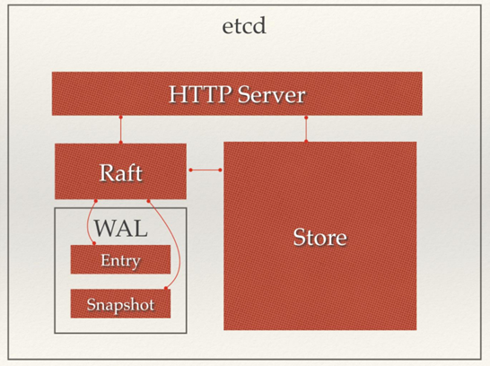

# ETCD  

## 介绍　　

etcd是一个分布式一致性键值存储系统，用于共享配置和服务发现，专注于：　　

* 简单：良好的定义，面向用户的API(gRPC)
* 安全：带有可选客户端证书认证的自动TLS
* 快速：经测试，每秒10000次写入
* 可靠：使用Raft适当分布  

etcd是Go编写，并使用Raft一致性算法来管理高可用复制日志，架构如下图所示：  



## 优势  

etcd可实现的功能，Zookeeper都能实现，那么为什么要用etcd而非直接使用Zookeeper？二者相比之下，Zookeeper有如下缺点：  

* 复杂。Zookeeper的部署维护复杂，管理员需要掌握一系列的知识和技能；而Paxos强一致性算法也是素来以复杂难懂而闻名于世；另外，Zookeeper的使用也比较复杂，需要安装客户端，官方只提供了java和C两种语言的接口。  
* Java编写。这里不是对Java有偏见，而是Java本身就偏向于重型应用，它会引入大量的依赖。而运维人员则普遍希望机器集群尽可能简单，维护起来也不易出错。
* 发展缓慢。Apache基金会项目特有的“Apache Way”在开源界饱受争议，其中一大原因就是由于基金会庞大的结构以及松散的管理导致项目发展缓慢。

而etcd作为一个后起之秀，其优点也很明显：  

* 简单。使用Go语言编写部署简单；使用HTTP作为接口使用简单；使用Raft算法保证强一致性让用户易于理解。
* 数据持久化。etcd默认数据一更新就进行持久化。
* 安全。etcd支持SSL客户端安全认证。

最后，etcd作为一个年轻的项目，正在高速迭代和开发中，这既是一个优点，也是一个缺点。优点在于它的未来具有无限的可能性，缺点是版本的迭代导致其使用的可靠性无法保证，无法得到大项目长时间使用的检验。然而，目前CoreOS、Kubernetes和Cloudfoundry等知名项目均在生产环境中使用了etcd，所以总的来说，etcd值得你去尝试。

## 安装  

etcd提供可直接运行的二进制文件，可从[这里](https://github.com/etcd-io/etcd/releases)选择对应平台的安装包。这里选择的是v3.4.0版。  

### 解压

> tar -zxvf etcd-v3.4.0-linux-amd64.tar.gz

### 查看etcd信息  

```bash
[root@etcd etcd-v3.4.0-linux-amd64]# ./etcd -version
etcd Version: 3.4.0
Git SHA: 898bd1351
Go Version: go1.12.9
Go OS/Arch: linux/amd64
```

### 启动etcd（后台启动）  

> nohup ./etcd > etcd.log 2>&1 &

也可在前台直接运行：  

> ./etcd

### 添加key

> **Note**：etcdctl需要设置环境变量 ETCDCTL_API=3，默认的api是2。

#### 设置环境变量  

```bash
[root@etcd etcd-v3.4.0-linux-amd64]# echo "ETCDCTL_API=3" >> /etc/profile
[root@etcd etcd-v3.4.0-linux-amd64]# source /etc/profile
```

```bash
[root@etcd etcd-v3.4.0-linux-amd64]# ./etcdctl put firstkey "this is a test"
OK
[root@etcd etcd-v3.4.0-linux-amd64]# ./etcdctl get firstkey
firstkey
This is a test
```  

## REST API 

### 查看版本信息  

```bash
[root@etcd etcd-v3.4.0-linux-amd64]# curl http://127.0.0.1:2379/version
{"etcdserver":"3.4.0","etcdcluster":"3.4.0"}
```

### 通过IP访问

如要通过IP访问则需要在启动时指定IP：  

```bash
./etcd --listen-client-urls http://0.0.0.0:2379 --advertise-client-urls http://0.0.0.0:2379 --listen-peer-urls http://0.0.0.0:2380
# 后台启动
nohup ./etcd --listen-client-urls http://0.0.0.0:2379 --advertise-client-urls http://0.0.0.0:2379 --listen-peer-urls http://0.0.0.0:2380 > /tmp/etcd.log 2>&1 &
```

> **Note**：0.0.0.0表示任意IP都可以访问，也可将它替换为本机IP  

```bash
[root@etcd etcd-v3.4.0-linux-amd64]# curl http://192.168.15.143:2379/version
{"etcdserver":"3.4.0","etcdcluster":"3.4.0"}
```