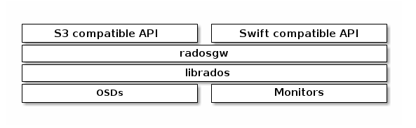

# Ceph Object GateWay  

[<font color="red">Ceph Object Gateway</font>](https://docs.ceph.com/docs/master/glossary/#term-ceph-object-gateway)是基于librados构建的对象存储接口，为Ceph存储集群提供RESTful网关服务。[<font color="red">Ceph Object Gateway</font>](https://docs.ceph.com/docs/master/glossary/#term-ceph-object-gateway)支持两种接口：  

1. **S3-compatible**：提供对象存储功能，兼容大部分Amazon S3 RESTful API接口。
2. **Swift-compatible**：提供对象存储功能，兼容大部分OpenStack Swift API接口。  

Ceph对象存储使用Ceph Object GateWay守护进程，它是一个HTTP服务，用来与Ceph存储集群通信。由于Ceph对象网关提供了兼容OpenStack Swift和Amazon S3的接口，所以它有自己的用户管理。Ceph对象网关可以存储来自同一Ceph存储集群的Ceph文件系统客户端或Ceph块设备客户端的数据。S3和Swift APIs共享一套通用的命名空间，所以你可以使用一种API来写入数据，用另一种来检索它们。  

  

> **Note**：Ceph对象存储并不需要Ceph元数据服务。

## 安装Ceph对象网关  

从*firefly*（v0.80）开始，Ceph对象网关运行在Civetweb（被嵌入到ceph-radosgw守护进程中）上，而不是Apache和FastCGI。使用Civetweb简化了Ceph对象网关的安装和配置。  

> **Note**：要运行Ceph对象网关服务，你应该拥有一个运行中的Ceph存储集群，网关服务器应该有权访问公共网络。

### 执行安装前的准备  

查看[<font color="red">此处</font>](https://docs.ceph.com/docs/master/start/quick-start-preflight)并在你的Ceph对象网关节点上执行预安装操作。额外说明，在你的Ceph Deploy用户上，你应该禁用*requiretty*，设置SELinux为*Permissive*，并设置Ceph Deploy用户为无密码的sudo用户。就Ceph对象网关而言，在生产环境中你应该开放Civetweb使用的端口。  

> **Note**：Civetweb默认使用7480端口。  

### 安装Ceph对象网关  

从你的管理员服务的工作目录安装Ceph对象网关包到Ceph对象网关节点。例如：  

> ceph-deploy install --rgw \<gateway-node1> [\<gateway-node2> ...]  

`ceph-common`包是依赖项，所以ceph-deploy也将安装它。ceph CLI工具是管理员需要的。要使你的Ceph对象网关成为管理员节点，需要在你的管理员服务的工作目录下执行以下命令：  

> ceph-deploy admin \<node-name>

### 创建网关实例  

从你的管理员服务的工作目录，在Ceph对象网关节点上创建Ceph对象网关实例。例如：  

> ceph-deploy rgw create \<gateway-node1>

网关运行起来后，像下面这样，你可以使用无认证的请求在7489端口上访问到：  

> http://client-node:7480  

如果网关实例正确运行，你将得到如下响应：  

```xml
<?xml version="1.0" encoding="UTF-8"?>
<ListAllMyBucketsResult xmlns="http://s3.amazonaws.com/doc/2006-03-01/">
       <Owner>
               <ID>anonymous</ID>
               <DisplayName></DisplayName>
       </Owner>
       <Buckets>
       </Buckets>
</ListAllMyBucketsResult>
```  

如果你的节点遇到问题或你想重新开始，执行以下操作清除配置：  

> ceph-deploy purge \<gateway-node1> [\<gateway-node2>]
> ceph-deploy purgedata \<gateway-node1> [\<gateway-node2>]

如果你执行了purge操作，那么你必须重新安装Ceph。  

### 修改默认端口  

默认情况下Civetweb运行在7480端口上。要改变默认端口（例如，改到80端口），修改你管理员服务的工作目录下的Ceph配置文件。增加一节条目[client.rgw.\<gateway-node>]，使用你的Ceph对象网关节点的简写名称（即，hostname -s得到的）替换\<gateway-node>。  

> **Note**：从v11.0.1开始，Ceph对象网关**支持**SSL。如何设置详见[<font color="red">Civetweb使用SSL</font>](https://docs.ceph.com/docs/master/install/install-ceph-gateway/#id2)。  

例如，如果你的节点名称为gateway-node1，在[global]章节下添加：  

```text
[client.rgw.gateway-node1]
rgw_frontends = "civetweb port=80"
```  

> **Note**：确保在*rgw_frontends*键值对中`port=<port-number>`之间没有留下空格。[client.rgw.gateway-node1]头将Ceph配置文件中的这一部分标识为配置Ceph存储集群客户端，其中客户端的类型是Ceph对象网关（即，rgw），实例的名称为gateway-node1。  

将更新的配置文件推送到你的Ceph对象网关节点（和其它节点）：  

> ceph-deploy --overwrite-conf config push \<gateway-node> [\<other-nodes>]  

要使新设置的端口生效，需要重启Ceph对象网关：  

> sudo systemctl restart ceph-radosgw  

最后，检查你所选的端口在防火墙上是否开放（例如，80端口）。如果没有开放，添加端口并重新导入防火墙配置。如果你使用的是`firewalld`，执行：  

> sudo firewalld-cmd --list-all
> sudo firewalld-cmd --zone-public --add-port 80/tcp --permanent
> sudo firewalld-cmd --reload  

如果你使用的是`iptables`，执行：  

> sudo iptables --list
> sudo iptables -I INPUT l -i \<iface> -p tcp -s \<ip-address>/\<netmask> --dprot 80 -j ACCEPT

使用你的Ceph对象网关节点的相关信息替换\<iface>和\<ip-address>/\<netmask>。  

完成iptables的配置之后，你必须确保你的修改是持续不变的，这样在重启你的Ceph对象网关节点之后，修改也会生效。执行：  

> sudo apt-get install iptables-persistent  

这将会打开一个UI终端。选择`yes`选项将当前的IPv4配置规则保存到`/etc/iptables/rules.v4`中，将当前的IPv6配置规则保存到`/etc/iptables/rules.v6`中。  

你上一步设置的IPv4配置规则将会导入到`/etc/iptables/rules.v4`中，即使重启之后也会生效。  

如果你在安装iptables-persistent之后添加新的IPv4规则，你必须将它添加到规则文件中。在这种情况下，使用root用户执行下列操作：  

> iptables-save > /etc/iptables/rules.v4

### Civetweb使用SSL  

在Civetweb使用SSL之前，你需要一个匹配主机名的证书，它将用来访问Ceph对象网关。为了更灵活你可能需要一个有*subject alternate name*字段的证书。如果你想要使用S3风格的子域（[<font color="red">添加通配符到DNS</font>](https://docs.ceph.com/docs/master/install/install-ceph-gateway/#id3)），你需要一个*通配符*证书。  

Civetweb要求在一个文件中提供服务密钥，服务证书，其它CA或中间证书。上述的每一项都必须是*pem*格式的。因为包含了服务密钥，所以这个组合文件应该避免非认证访问。  

要配置ssl选项，需要在端口后追加s。例如：  

```text
[client.rgw.gateway-node1]
rgw_frontends = civetweb prot=443s ssl_certificate=/etc/ceph/private/keyandcert.pem
```  

以下是在Luminous版中新增的。  

Civetweb可以绑定到多个端口，在配置文件中用 **\+** 分隔。适用于单个rgw实例中同时使用ssl和non-ssl连接的使用场景。例如：  

```text
[client.rgw.gateway-node1]
rgw_frontends = civetweb prot=80+443s ssl_certificate=/etc/ceph/private/keyandcert.pem
```  

### 额外的Civetweb配置选项  

可以在ceph.conf文件中的**Ceph Object Gateway**章节部分为嵌入的Civetweb web服务器调整一些额外的配置选项。支持的选项列表，包括示例，详见[<font color="red">HTTP Forntends</font>](https://docs.ceph.com/docs/master/radosgw/frontends)。  

### 从Apache迁移到Civetweb  

如果你使用v0.80或之前的Ceph存储在Apache和FastCGI上运行Ceph对象网关，所以你已经使用ceph-radosgw守护进程运行Civetweb-it，默认情况下它运行在7480端口，所以它不会与你的Apache和FastCGI安装或其它常用web服务端口冲突。迁移到使用Civetweb基本上需要删除你的Apache安装。这样，你必须从你的Ceph配置文件中移除Apache和FastCGI，然后重新设置rgw_frontends为Civetweb。  

返回使用ceph-deploy安装Ceph对象网关说明，注意配置文件中只有一条rgw_frontends设置（并且假定你选择修改默认的端口）。ceph-deploy工具创建数据目录和密钥环，密钥环放在`/var/lib/ceph/radosgw/{rgw-intance}`目录。守护进程可在默认位置找到，你可能在你的Ceph配置文件中指定了不同的目录。此时你已经准备好了密钥和数据目，如果你使用默认路径意外的位置，你需要在你的Ceph配置文件中声明这些路径。  

典型的基于Apache部署的Ceph对象网关配置文件类似于下面的内容：  

在Red Hat Enterprise Linux：  

```text
[client.radosgw.gateway-node1]
host = {hostname}
keyring = /etc/ceph/ceph.client.radosgw.keyring
rgw socket path = ""
log file = /var/log/radosgw/client.radosgw.gateway-node1.log
rgw frontends = fastcgi socket\_port=9000 socket\_host=0.0.0.0
rgw print continue = false
```

在Ubuntu：  

```text
[client.radosgw.gateway-node]
host = {hostname}
keyring = /etc/ceph/ceph.client.radosgw.keyring
rgw socket path = /var/run/ceph/ceph.radosgw.gateway.fastcgi.sock
log file = /var/log/radosgw/client.radosgw.gateway-node1.log
```  

要修改它来使用Civetweb，只需要移除Apache特定的设置，比如rgw_socket_path和rgw_print_continue。然后，修改rgw_frontends设置，使用Civetweb取代Apache FastCGI和指定你选择使用的端口。例如：  

```text
[client.radosgw.gateway-node1]
host = {hostname}
keyring = /etc/ceph/ceph.client.radosgw.keyring
log file = /var/log/radosgw/client.radosgw.gateway-node1.log
rgw_frontends = civetweb port=80
```  

最后，重启Ceph对象网关。在Red Hat Enterprise Linux上执行：  

> sudo systemctl restart ceph-radosgw.service

Ubuntu上执行：  

> sudo service radosgw restart id=rgw.\<short-hostname>

如果你使用的端口为开放，你需要在你的防火墙上开放端口。  

### 配置桶分片  

Ceph对象网关在index_pool中存储桶索引数据，默认为`.rgw.buckets.index`。有时，用户喜欢在一个桶中放入很多对象（成百上万的对象）。如果不使用网关管理界面为每个存储桶设置最大对象数的配额，那么当用户将大量对象放入存储桶时，存储桶索引会遭受严重的性能下降。  

在Ceph v0.94，你可以对存储桶索引进行分片，以防止允许单个存储桶存储大量对象时出现性能瓶颈。`rgw_overrode_bucket_max_shards`设置允许你设置每个存储桶的最大分片数量。其默认值为0，意味着默认关闭存储桶索引分片。  

要启用存储桶索引分片，只需设置`rgw_overrode_bucket_max_shards`大于0即可。  

为了简化配置，你可以在你的Ceph配置文件中添加`rgw_overrode_bucket_max_shards`。在[global]下添加它来创建系统级别的变量。你也可以在你的Ceph配置文件中未每一个实例设置它。  

一旦在你的Ceph配置文件中改变了你的存储桶分片配置，你需要重启你的网关。在Red Hat Enterprise Linux上执行：  

> sudo systemctl restart ceph-radosgw.service

在Ubuntu上：  

> sudo service radosgw restart id=rgw.\<short-hostname>

对于联合配置，每个区域对于故障转移可能有不同的index_pool设置。要使zonegroup区域的值保持一致，你可以在网关的zonegroup配置中设置`rgw_override_bucket_index_max_shards`。例如：  

> radosgw-admin zonegroup get > zonegroup.json

打开zonegroup.json文件，为每个命名的区域设置`bucket_index_max_shards`。保存文件，重置zonegroup。例如：  

> radosgw-admin zonegroup set < zonegroup.json  

一旦你更新了你的zonegroup，更新并提交。例如：  

> radosgw-admin period update --commit  

> **Note**：将索引池（对于每个区域，如果适用）映射到基于SSD的OSD的CRUSH规则也可以有助于桶索引性能。

### 添加通配符到DNS  

要将Ceph用在S3风格的子域（例如，bucket-name.domain-name.com）中，你需要将通配符添加到与ceph-radosgw守护进程一起使用的DNS服务器的DNS记录中。  

DNS的地址必须在Ceph配置文件中用`rgw dns name = {hostname}`指明设置。  

对于dnsmasq，条件如下在主机名前加上“.”做前缀的地址设置：  

> address=/.{hostname-or-fqdn}/{host-ip-address}

例如：  

> address=/.gateway-node1/192.168.122.75

对于bind，添加通配符到DNS记录。例如：  

```bash
$TTL    604800
@       IN      SOA     gateway-node1. root.gateway-node1. (
                              2         ; Serial
                         604800         ; Refresh
                          86400         ; Retry
                        2419200         ; Expire
                         604800 )       ; Negative Cache TTL
;
@       IN      NS      gateway-node1.
@       IN      A       192.168.122.113
*       IN      CNAME   @
```  

重启你的DNS服务，并使用子域来ping你的服务，来确保你的DNS配置如预期一样工作：  

> ping mybucket.{hostname}

例如：  

> ping mybucket.gateway-node1

### 添加调试（必要时）  

完成设置过程后，如果遇到配置问题，可以在Ceph配置文件的[global]部分添加调试并重新启动网关以帮助解决任何配置问题。例如：  

```text
[global]
#append the following in the global section.
debug ms = 1
debug rgw = 20
```  

### 使用网关  

要使用REST接口，首先要为S3接口创建一个初始Ceph对象网关用户，然后为Swift接口创建一个子用户。最后你需要确认创建的用户能够访问到网关。  

#### 为S3访问创建RADOSGW用户  

radosgw用户需要被创建和准许访问。`man radowgw-admin`命令将提供额外的命令选项信息。  

要创建用户，在网关主机执行如下操作：  

> sudo radosgw-admin user create --uid="testuser" --display-name="First User"

该命令的输出信息类似下面的：  

```json
{
        "user_id": "testuser",
        "display_name": "First User",
        "email": "",
        "suspended": 0,
        "max_buckets": 1000,
        "subusers": [],
        "keys": [{
                "user": "testuser",
                "access_key": "I0PJDPCIYZ665MW88W9R",
                "secret_key": "dxaXZ8U90SXydYzyS5ivamEP20hkLSUViiaR+ZDA"
        }],
        "swift_keys": [],
        "caps": [],
        "op_mask": "read, write, delete",
        "default_placement": "",
        "placement_tags": [],
        "bucket_quota": {
                "enabled": false,
                "max_size_kb": -1,
                "max_objects": -1
        },
        "user_quota": {
                "enabled": false,
                "max_size_kb": -1,
                "max_objects": -1
        },
        "temp_url_keys": []
}
```  

> **Note**：key->access_key和key->secret_key的值需要用于访问认证。  

#### 创建Swift用户  

如果需要Swift访问类型的话，Swift子用户才被创建。创建Swift用户需要两步。第一步创建用户，第二步创建密钥。  

在网关主机上执行下列步骤：  

创建Swift用户：  

> sudo radosgw-admin subuser create --uid=testuser --subuser=testuser:swift --access=full  

返回信息类似下面：  

```json
{
        "user_id": "testuser",
        "display_name": "First User",
        "email": "",
        "suspended": 0,
        "max_buckets": 1000,
        "subusers": [{
                "id": "testuser:swift",
                "permissions": "full-control"
        }],
        "keys": [{
                "user": "testuser:swift",
                "access_key": "3Y1LNW4Q6X0Y53A52DET",
                "secret_key": ""
        }, {
                "user": "testuser",
                "access_key": "I0PJDPCIYZ665MW88W9R",
                "secret_key": "dxaXZ8U90SXydYzyS5ivamEP20hkLSUViiaR+ZDA"
        }],
        "swift_keys": [],
        "caps": [],
        "op_mask": "read, write, delete",
        "default_placement": "",
        "placement_tags": [],
        "bucket_quota": {
                "enabled": false,
                "max_size_kb": -1,
                "max_objects": -1
        },
        "user_quota": {
                "enabled": false,
                "max_size_kb": -1,
                "max_objects": -1
        },
        "temp_url_keys": []
 }
```  

创建密钥：  

> sudo radosgw-admin key create --subuser=testuser:swift --key-type=swift --gen-secret

返回信息类似下面：  

```json
{
        "user_id": "testuser",
        "display_name": "First User",
        "email": "",
        "suspended": 0,
        "max_buckets": 1000,
        "subusers": [{
                "id": "testuser:swift",
                "permissions": "full-control"
        }],
        "keys": [{
                "user": "testuser:swift",
                "access_key": "3Y1LNW4Q6X0Y53A52DET",
                "secret_key": ""
        }, {
                "user": "testuser",
                "access_key": "I0PJDPCIYZ665MW88W9R",
                "secret_key": "dxaXZ8U90SXydYzyS5ivamEP20hkLSUViiaR+ZDA"
        }],
        "swift_keys": [{
                "user": "testuser:swift",
                "secret_key": "244+fz2gSqoHwR3lYtSbIyomyPHf3i7rgSJrF\/IA"
        }],
        "caps": [],
        "op_mask": "read, write, delete",
        "default_placement": "",
        "placement_tags": [],
        "bucket_quota": {
                "enabled": false,
                "max_size_kb": -1,
                "max_objects": -1
        },
        "user_quota": {
                "enabled": false,
                "max_size_kb": -1,
                "max_objects": -1
        },
        "temp_url_keys": []
}
```  

#### 访问确认  

#### 测试S3访问  

你需要编写和执行Python脚本来确认S3访问。S3访问测试脚本会连接radosgw，创建一个新的存储桶并列出所有的存储桶。`aws_access_key_id`和`aws_secret_access_key`的值通过`radosgw-admin`命令从返回的`access_key`和`secret_key`获取。  

执行下列步骤：  

1. 你需要安装`python-boto`包：  

> sudo yum install python-boto

2. 创建Python脚本：  

> vi s3test.py

3. 添加下列信息到文件中：  

```python
import boto.s3.connection

access_key = 'I0PJDPCIYZ665MW88W9R'
secret_key = 'dxaXZ8U90SXydYzyS5ivamEP20hkLSUViiaR+ZDA'
conn = boto.connect_s3(
        aws_access_key_id=access_key,
        aws_secret_access_key=secret_key,
        host='{hostname}', port={port},
        is_secure=False, calling_format=boto.s3.connection.OrdinaryCallingFormat(),
       )

bucket = conn.create_bucket('my-new-bucket')
for bucket in conn.get_all_buckets():
    print "{name} {created}".format(
        name=bucket.name,
        created=bucket.creation_date,
    )
```  

使用你在网关服务器上配置的主机名称替换`{hostname}`，例如gatewayhost。使用你选择的Civetweb端口替换`{port}`。  

4. 执行脚本：  

> python s3test.py

输出类似下面的信息：  

> my-new-bucket 2015-02-16T17:09:10.000Z

#### 测试Swift访问  

Swift访问的确认是通过Swift命令行客户端。`man swift`命令将提供额外的命令选项信息。  

要安装swift客户端，执行下列命令。在Red Hat Enterprise Linux：  

> sudo yum install python-setuptools
> sudo easy_install pip
> sudo pip install --upgrade setuptools
> sudo pip install --upgrade python-swiftclient

在Debian系：  

> sudo apt-get install python-setuptools
> sudo easy_install pip
> sudo pip install --upgrade setuptools
> sudo pip install --upgrade python-swiftclient  

要测试swift访问，执行下列命令：  

> swift -V 1 -A http://{IP ADDRESS}:{port}/auth -U testuser:swift -K '{swift_secret_key}' list

使用网关服务器的公网IP替换`{IP ADDRESS}`，`{swift_secret_key}`的值来自为*swift*用户创建密钥执行的`radosgw-admin`命令。使用你选择的Civetweb端口（例如，默认的7480）替换`{port}`。如果你没有替换，将使用默认的80端口。  

例如：  

> swift -V 1 -A http://10.19.143.116:7480/auth -U testuser:swift -K '244+fz2gSqoHwR3lYtSbIyomyPHf3i7rgSJrF/IA' list

输出应该是：  

> my-new-bucket

## HTTP前端  

Ceph对象网关支持两种通过`rgw_frontends`配置的嵌入的HTTP前端库。详细语法，详见[<font color="red">配置引用</font>](https://docs.ceph.com/docs/master/radosgw/config-ref)。  

### <font color="red">BEAST</font>  

自Mimic引入。  

beast前端使用Boost。Beast库解析HTTP，Boost.Asio库实现异步网络I/O。  

#### <font color="red">选项</font>  

##### port和ssl_port  

**描述**：设置ipv4和ipv6监听端口。可多次执行，如`port=80,port=8000`。
**类型**：Integer
**默认值**：80  

##### endpoint和ssl_endpoint  

**描述**：设置监听地址，以点分隔的10进制IPV4地址或方括号括起来的16进制的IPV6地址。指定IPV6终端的话将只监听IPV6地址。默认普通终端使用80端口，SSL终端使用443端口。可以设置多个，例如：`endpoint=[::1] endpoint=192.168.0.100:8000`。  
**类型**：Integer  
**默认值**：None  

##### ssl_certificate  

**描述**：SSL-enabled终端使用的SSL证书的路径
**类型**：String
**默认值**：None  

##### ssl_private_key  

**描述**：可选项，SSL-enabled终端使用的私钥文件路径。如果未设置，ssl_certificate文件将被作为私钥使用。  
**类型**：String  
**默认值**：None  

##### tcp_nodelay  

**描述**：如果设置socket选项，连接时将禁用Nagel算法，这意味着包会尽可能快的发送，而不是等待全部数据或超时。  
$\qquad \qquad$ 1 所有socket禁用Nagel算法。
$\qquad \qquad$ 0 使用默认：启用Nagel算法  
**类型**：Integer（0或1）
**默认**：0  

### <font color="red">Civetweb</font>  

自Firefly引入。  

civetweb前端使用Civetweb HTTP库，是Mongoose的一个分支。  

#### <font color="red">选项</font>  

##### port

**描述**：设置监听端口。对于SSL-enabled端口，添加`s`后缀，比如443s。要绑定执行IPv4或IPv6地址，使用格式`address:port`。多个端口使用`+`分隔，例如`127.0.0.1:8000+443s`，或者通过提供多个选择，例如`port=8000 port=443s`。
**类型**：String
**默认值**：7480  

##### num_threads  

**描述**：设置Civetweb用来处理传入的HTTP连接的线程数。
**类型**：Integer
**默认值**：rgw_thread_pool_size  

##### request_timeout_ms  

**描述**：设置Civetweb放弃连接之前等待传入数据的时间上限，单位毫秒。
**类型**：Integer
**默认值**：30000  

##### access_log_file  

**描述**：存储访问日志的文件的路径。可以是绝对路径，也可以是相对路径。如果缺失（默认），则不记录访问信息。
**类型**：String
**默认值**：EMPTY  

##### error_log_file  

**描述**：存储错误日志的文件的路径。可以是绝对路径，也可以是相对路径。如果缺失（默认），则不记录错误信息。
**类型**：String
**默认值**：EMPTY  

下面是包含上述选项设置的`/etc/ceph/ceph.conf`文件示例：  

```text
[client.rgw.gateway-node1]
rgw_frontends = civetweb request_timeout_ms=30000 error_log_file=/var/log/radosgw/civetweb.error.log access_log_file=/var/log/radosgw/civetweb.access.log
```  

完整的支持选项列表，详见[<font color="red">这里</font>](https://civetweb.github.io/civetweb/UserManual.html)。  

### <font color="red">通用选项</font>  

有些选项是通用的，被所有的前端所支持：  

#### prefix  

**描述**：前缀字符是插入到所有URI中的。例如，仅支持swift前端，它的uri前缀是`/swift`。
**类型**：String
**默认值**：None  

## 归置组和存储类别  

### <font color="red">归置标签</font>  

*自Jewel引入*。  

归置标签管理着[<font color="red">资源池</font>](https://docs.ceph.com/docs/master/radosgw/pools)与特定存储桶之间的关系。存储桶的归置标签在创建时选定，并且之后无法改变。`radosgw-admin bucket status`命令可以陈列出它的归置规则（placement_rule）。  

条带组配置包含了一个初识标签名为`default-palcement`的归置标签列表。之后的条带化配置将每一个条带组的归置标签映射到它的本地存储。条带化归置信息包括存储桶索引的索引池名称、不完整分段上传元数据的data_extra_pool名、每个存储类别的data_pool名称。  

### <font color="red">存储类别</font>  

*自Nautilus引入*。  

存储类型被用来改进对象数据的归置。S3 Bucket Lifecycle规则可以自动化两个存储类型之间的对象转换。  

存储类型被定义在归置标签的条目中。每一个条带组的归置标签罗列出它可用的存储类型，初始化类型名为STANDARD。条带化配置负责为条带组的每个存储类提供data_pool池名称。  

### <font color="red">条带组/条带化配置</font>  

使用`radosgw-admin`命令在条带组合条带上执行归置配置。  

条带组的归置配置请求如下：  

```bash
$ radosgw-admin zonegroup get
{
    "id": "ab01123f-e0df-4f29-9d71-b44888d67cd5",
    "name": "default",
    "api_name": "default",
    ...
    "placement_targets": [
        {
            "name": "default-placement",
            "tags": [],
            "storage_classes": [
                "STANDARD"
            ]
        }
    ],
    "default_placement": "default-placement",
    ...
}
```  

条带的归置配置请求如下：  

```bash
$ radosgw-admin zone get
{
    "id": "557cdcee-3aae-4e9e-85c7-2f86f5eddb1f",
    "name": "default",
    "domain_root": "default.rgw.meta:root",
    ...
    "placement_pools": [
        {
            "key": "default-placement",
            "val": {
                "index_pool": "default.rgw.buckets.index",
                "storage_classes": {
                    "STANDARD": {
                        "data_pool": "default.rgw.buckets.data"
                    }
                },
                "data_extra_pool": "default.rgw.buckets.non-ec",
                "index_type": 0
            }
        }
    ],
    ...
}
```  

> **Note**：如果你没有预习[多点配置](https://docs.ceph.com/docs/master/radosgw/multisite)，默认的条带和条带组为你而建，除非Ceph对象网关重启，否则对条带/条带组的修改都不会生效。如果你为多站点创建了一个区域，一旦使用`radosgw-admin update --commit`命令将修改提交，条带/条带组更改将会生效。

#### 添加归置标签  

要创建一个名为temporary的新归置标签，始于将其添加到条带组：  

```bash
$ radosgw-admin zonegroup placement add \
      --rgw-zonegroup default \
      --placement-id temporary
```  

然后为这个标签提供条带化归置信息：  

```bash
$ radosgw-admin zone placement add \
      --rgw-zone default \
      --placement-id temporary \
      --data-pool default.rgw.temporary.data \
      --index-pool default.rgw.temporary.index \
      --data-extra-pool default.rgw.temporary.non-ec
```  

#### 添加存储类型  

添加一个名为COLD的新的存储类到default-placement标签中，始于将其添加到条带组：  

```bash
$ radosgw-admin zonegroup placement add \
      --rgw-zonegroup default \
      --placement-id default-placement \
      --storage-class COLD
```  

然后为这个存储类型提供条带化归置信息：  

```bash
$ radosgw-admin zone placement add \
      --rgw-zone default \
      --placement-id default-placement \
      --storage-class COLD \
      --data-pool default.rgw.cold.data \
      --compression lz4
```  

### <font color="red">自定义归置</font>  

#### 默认归置  

默认情况下，新的存储桶将使用条带组的default-placement标签。条带组的设置可以被改变：  

```bash
$ radosgw-admin zonegroup placement default \
      --rgw-zonegroup default \
      --placement-id new-placement
```  

#### 用户归置  

Ceph对象网关用户可以通过在用户信息中设置一个非空的default-placement来覆盖条带组默认的归置标签。简言之，default_storage_class可以覆盖STANDARD提供给对象的默认存储类型。  

```bash
$ radosgw-admin user info --uid testid
{
    ...
    "default_placement": "",
    "default_storage_class": "",
    "placement_tags": [],
    ...
}
```

如果条带组的归置标签包含任何标记，用户将无法使用该归置标签创建存储桶，除非其用户信息在其placement_tags字段中包含至少一个匹配的标记。这对于限制对某些存储类型的访问非常有用。  

radosgw-admin命令不能直接修改那些字段，所以必须手动编辑json文件：  

```bash
$ radosgw-admin metadata get user:<user-id> > user.json
$ vi user.json
$ radosgw-admin metadata put user:<user-id> < user.json
```  

#### S3存储桶归置  

当使用S3协议创建存储桶是，归置标签可以作为LocationConstraint的一部分被提供，用来覆盖来自用户和条带组的默认归置标签。  

通常，LocationConstraint必须匹配条带组的api名称：  

```xml
<LocationConstraint>default</LocationConstraint>
```  

自定义的归置标签可以被添加到“:”之后：  

```xml
<LocationConstraint>default:new-placement</LocationConstraint>
```  

#### Swift存储桶归置  

当使用Swift协议创建存储桶时，归置标签可在HTTP头**X-Storage-Policy**提供：  

```
X-Storage-Policy: new-placement
```  

### <font color="red">使用存储类型</font>  

所有的归置标签都有一个STANDARD存储类型，默认下新对象创建时提供。用户可以使用它`default_storage_class`覆盖默认值。  

要创建一个非默认存储类型的对象，在请求的HTTP头中提供存储类型名称即可。S3协议使用**X-Amz-Storage-Class**头，Swift协议使用**X-Object-Storage-Class**头。  

然后，可以使用S3对象生命周期管理通过使用Transition操作在存储类型间移动对象数据。  